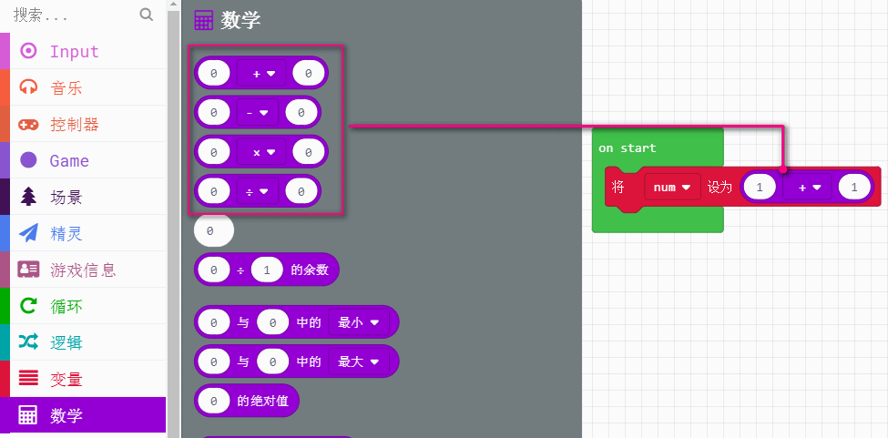
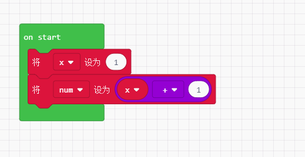
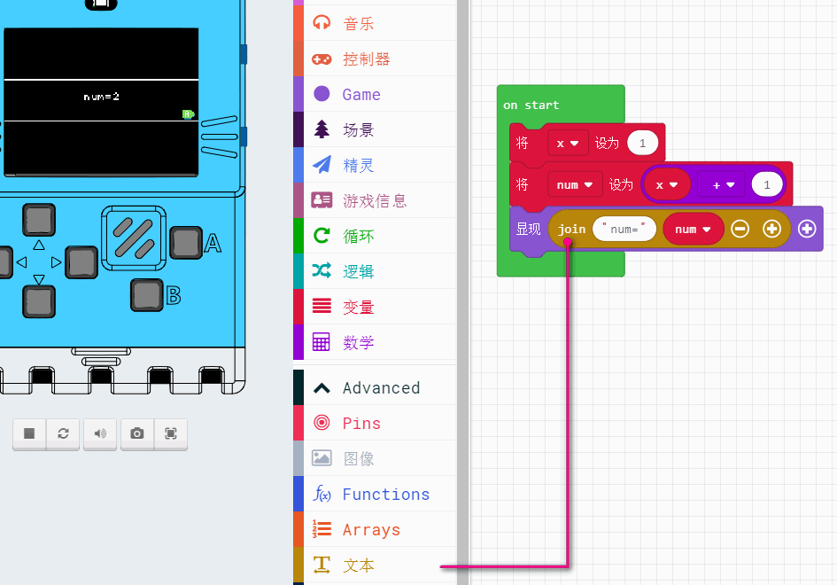

# 第三节：变量与数学  

谈起变量，众所周知它是一个存储的容器，一般来说最简单的作用就是于存储数字，比如在数学层面上的方程：y=2x+1,其中y和x都是变量。但在Arcade平台中，变量比想象中重要，甚至可以说一切操作都建立在变量这个基础上。  

了解变量的重要前需要理解`对象`的概念,简而言之就是我们游戏的角色和场景十分多，每个都是一个对象实例且每个都应该有各自的运动方式和生命周期等属性值，而空项目下只存在一个对象原型，根据搜索JS面向对象的相关知识我们可以得知变量用于根据原型对象创建一个新对象并且完全继承它的属性和方法。 

?>(打个比方：在喵星球上的居民叫做喵人，喵人就是一个抽象概念的对象原型。他们都有着外貌，身高，体重等等属性，其中有个喵人叫做CC喵，那么他也必须有外貌，身高，体重这些属性。可以把变量就看成CC喵，就是抽象概念-喵人的实例化)  

在`第二节`中我们创建精灵所使用的`mySprite`本身就是一个变量，它的作用就在于创建一个新对象。变量这个词同时也意味着`可变性`，我们可以改变变量的指向，比如让`mySprite`这个变量指向一个完全不同的精灵。

本节课我们主要介绍的还是变量在数学层面上的结合,需要完成如下目标

1. 熟练使用数学运算符(+、 -、 *、 /)
2. 建立一个二元一次方程
3. 将方程的结果通过提示框显示在屏幕上

## 要点1：熟悉数学运算符  
  
①. 首先我们新建一个用来存储算式数值的变量num  

  
 
②. 在`数学`分栏下的加减乘除积木块，我们如图拖到变量后等同于 num = 1 + 1
  
  

## 要点2：建立一个一元二次方程  

使用相同的方式建立一个变量x，并且给它赋一个初始值1，如下等同于 num = x + 1 (x = 1) 

  

## 要点3：显示  
  
显示我们在此使用`显现`这个积木块，它在`Game`分栏下。我们的目的是将方程的结果num显示在屏幕上。
  
!>看看下面的程序，为什么会报错呢？  

   

再看看下面这个程序，当我们使用`文本`分栏下的join积木块后，能够成功显示不报错了。  

   

?>这个积木块需要的是一个`字符串`类型作为参数  
说到数据类型就普及一下其分类  
数据值类型包括：【数字，字符串，布尔值，对空，未定义】  
而我们的num本身是数字。在JS中要将数字转换成字符串的最简单方法就是数字和字符串相加(可以使空字符串既“ ”)
所以这里我们使用`join`积木块，有兴趣的话可以转到JS代码区域一看究竟
  
---

**这节课我们学到了什么?**
- 关于什么是对象，能够有一个大概的头绪
- 为什么变量不能直接放置在`显现`积木块后显示出来

