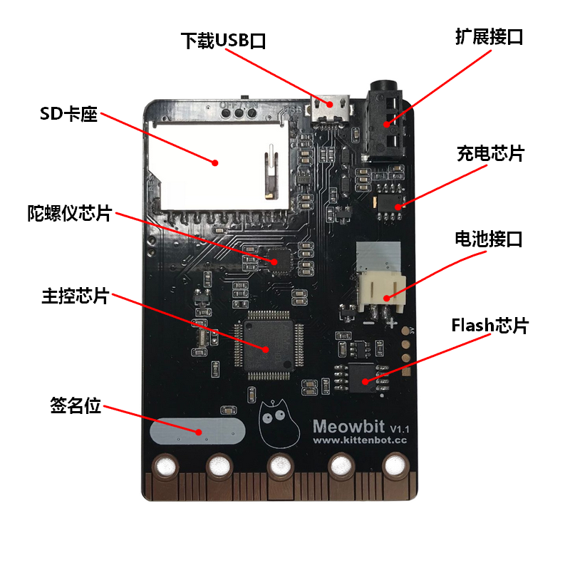
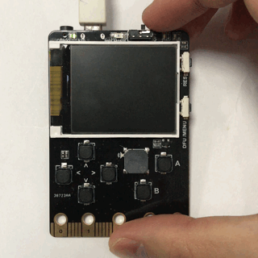
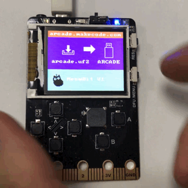

# 喵bit简介

---

喵bit是一款兼容Microbit金手指40PIN接口的编程游戏机，用于学习makecode图形化编程与micropython编程。板载丰富的资源。一个160x128像素的彩色tft屏幕，板载2MByte的spi-flash默认烧录unicode字符表，6个可编程按键，2个可编程led，6轴陀螺仪和加速度计，光敏传感器和温度传感器。

顶部带有usb通信下载口，和JAC接口（兼容喵家后续jac总线的各种模块）还有一个sd卡槽，方便大家将程序或者数据文件放在sd卡上并执行(后续工作)。并且板载了锂电池的接口和对应的充电电路。

底部40PIN金手指接口兼容市面上几乎所有microbit扩展板，方便大家从microbit升级到更高级的玩法。

## 技术参数

---

主控板大小尺寸：52x76x12mm

主控芯片：STM32F401RET6,32位ARM Cortex M3内核

## 传感器硬件资源：

---

160x128像素全彩tft屏幕

默认烧录unicode字符表的2MByte的spi-flash

6个可编程按键

2个可编程led

可编程蜂鸣器

6轴陀螺仪和加速度计

光敏传感器

温度传感器。

JAC接口

SD卡槽

复位按键

DFU模式按键（用于刷固件切换编程模式）

3.7V锂电池接口

兼容Microbit40PIN金手指接口

## 输入与输出

---

USB充电电压：5V（电流1A或以上）
主控板最大输出电流：300MA
外部电池接口输入电压：3.7~4.2V

## 配件（豪华顶配套件）：

---

硅胶保护套
配套锂电池包
MicroUSB数据线
挂绳

## 编程模式

---

makecode图形化编程模式

micropython编程模式

## 可支持编程软件：

---

Makecode在线，Makecode离线版

Kittenblock（Scratch 3.0）图形化编程软件需要同时支持tensorflow插件，可支持Scratch转译Python，可支持Scratch转译C++，可支持矢量图电子元器件连线，可支持兼容5种以上硬件产品且能提供软件著作权，支持PC段到APP端跨屏读取程序

Mueditor

## 支持系统：

---

Windows，macOS平台

## 开机

---

插上USB线供电，打开开关

## U盘模式与工作模式切换

---

点击右侧复位键，就从U盘模式进入工作模式

再点击一下，就又从工作模式进入U盘模式

