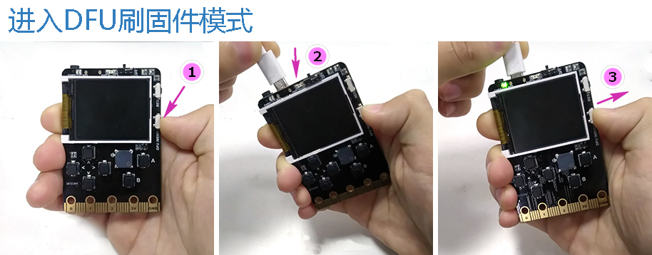
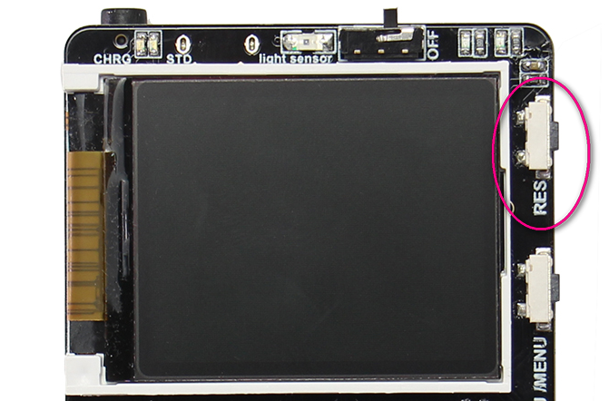

# 固件刷新教程

**这个篇幅是讲解如何更换micropython固件，如果你只用Makecode编程，这篇帖子可以跳过，喵bit默认出厂烧录了Makecode的固件**

喵bit存在两种模式，分别是makecode和micropython，两种模式切换的时候需要刷入不同的固件。

出厂固件默认为makecode模式~

首先了解下操作框架：

## 下载固件更新包

---

请先下载meobit的固件升级包，地址如下

[http://cdn.kittenbot.cn/meowbit/dfutil.zip](http://cdn.kittenbot.cn/meowbit/dfutil.zip)

将其解压到你的电脑上，等下我们会用到。(360流氓杀毒软件会报错为病毒，添加信任即可，它会把.exe的执行文件怀疑成病毒)

## 进入dfu模式

---

请按住喵bit侧边的DFU按键，之后插上usb数据线。（这里用的是旧版本电路板，新版同理）

成功进入dfu模式后应该可以在电脑设备管理器中看到一个新的设备（**这时候dfu按键就可以松开了**），不同电脑显示名称有所区别，但是都会有STM32....的设备

我的电脑显示：

我同事电脑显示：

如果windows尝试从网络自动安装驱动，可以不用理会它或者中断。

## 替换dfu驱动程序

---

打开“zddig-2.4.exe” 如果你解压找不到这个，肯定是被360这个流氓软件杀了

打开后界面：

在options选择list all devices

之后在下拉框中找到STM32 BOOTLOADER，并选择Install Driver

驱动安装时间比较长请耐心等待。。。

提示这个，即安装成功：

## 更新对应的固件

---

在升级包下有两个bat脚本，分别对应Makecode和micropython的固件升级功能

**只需要双击**对应的bat脚本（makecode/micropython），之后会弹出一个升级框

## 固件更新成功

---
最后按下喵bit侧边的复位按键

分别刷了makecode的固件和micropython的固件后，用数据线连接电脑识别成U盘情况

