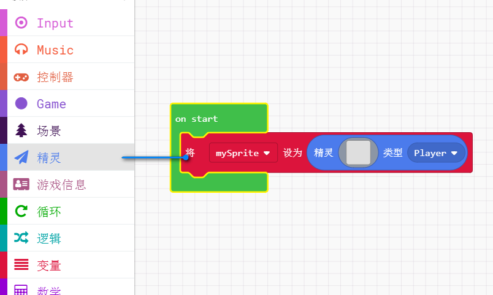
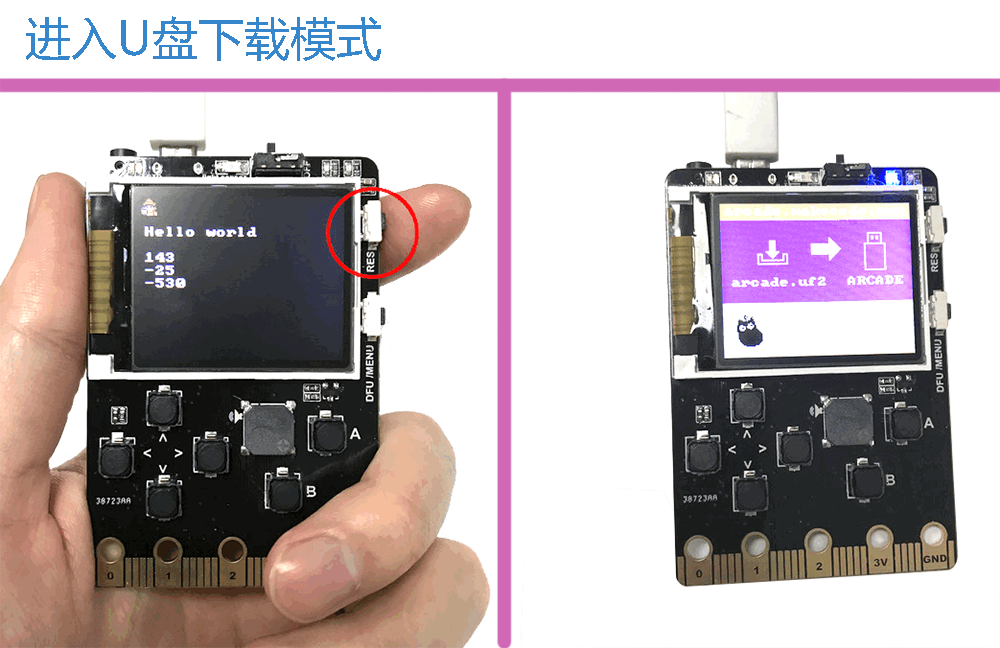
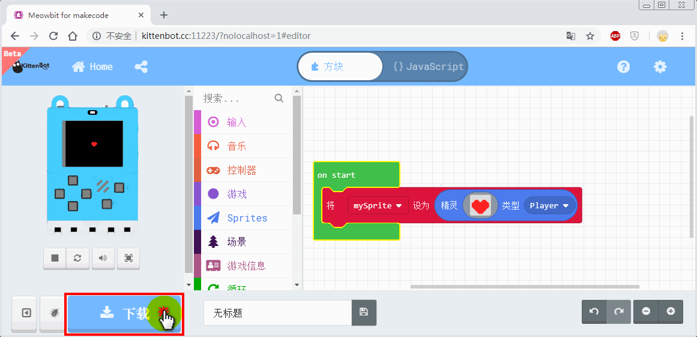
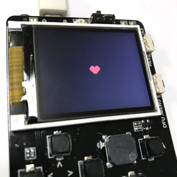

# 喵bit版Makecode简介与下载教程

## 在线编程地址

[http://kittenbot.cn:11223/?nolocalhost=1#editor](http://kittenbot.cn:11223/?nolocalhost=1#editor)

喵bit是喵家的又一重量级产品，为了让用户快速体验到我们的软件，我们提前把beta版本放出，让大家能提前体验到我们的软件。此过程你可能遇到一些bug或者体验不友好的地方，可以向小喵团队第一时间提出。谢谢各位天使用户对小喵科技的支持!

后续在线版本测试OK后，喵家会制作成离线版本形式以供大家下载。

## 界面介绍

如果你之前已经使用过Microbit，那么你对这个界面一定会很熟悉，还是原来的makecode，唯一不同就是，硬件只是换成了喵bit游戏机，因此仿真模拟器也换成了喵bit游戏机。

编程方式还是一样，从积木块分栏拖积木块到编程区，编写一个正确程序，点击下载。

## 下载程序流程

### 编写正确的程序

这里编写了一个让屏幕显示 helloworld 的程序

### 主控板点复位键，进入U盘模式

### 点击下载程序保存在“Arcade”的U盘上

### 下载成功现象

----------

## F&Q常见问题与解答

### 喵bit跟Micorbit有什么区别

喵bit是小喵科技推出的一款围绕编程游戏的主控板，底部40PIN金手指兼容micorbit的插槽。它涵盖了Microbit的所有硬件资源，甚至说是在其上做了升级。喵bit上的彩屏和6颗硅胶按键这个配置的组合使它成为不折不扣的低配版游戏机。

简单来说：

Microbit是用硬件来学习编程

喵bit除了用升级版的硬件来学习编程以外，还有通过软件中专用的游戏积木块，可以做出很多经典的小游戏。

### 用常规的makecode可以控制喵bit么？

不可以，喵bit有特定版本的makecode

### Micorbit的程序可以直接烧录到喵bit中么？

不可以，虽然都是makecode编程，但是编程积木块都是稍有差别，不能做成通用的

### 仿真模拟器区真的可以仿真吗？

是的，仿真模拟器区所见即所得

### 什么时候出离线版本？

等在线版本测试稳定后就会出离线版本

### 这个喵bit可以插到Robotbit或者IObit上使用吗？

可以的，后续针对喵bit的Robotbit插件会补上
