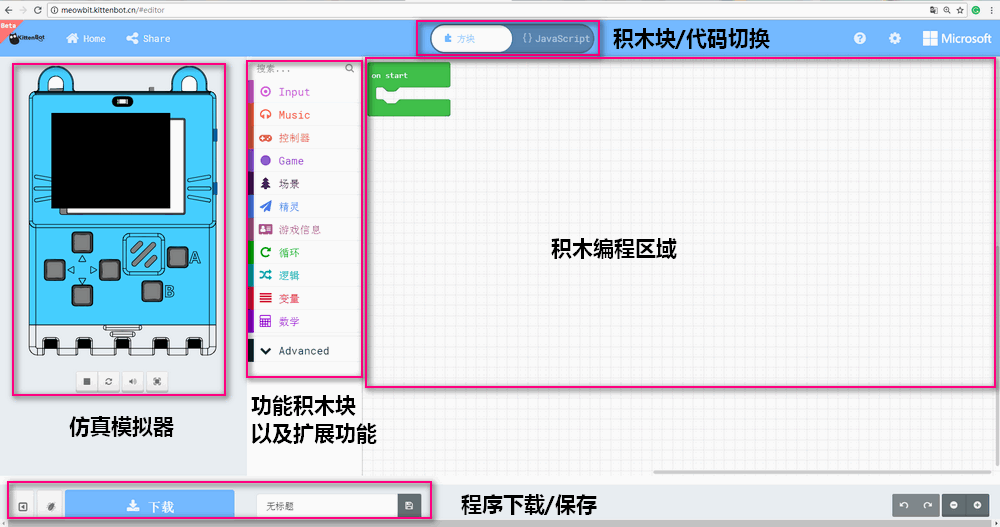
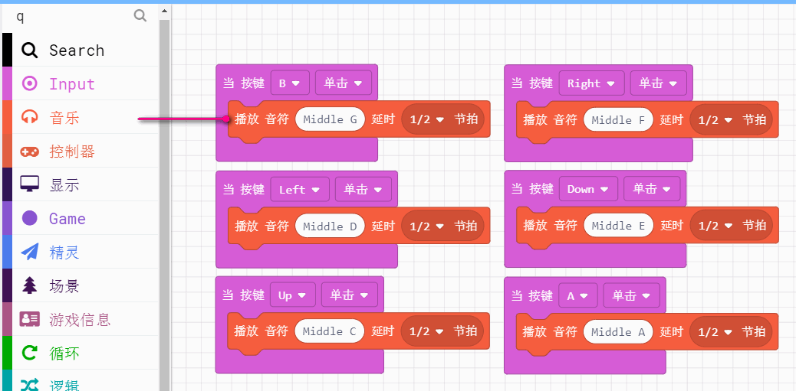

# Makecode使用简介 {docsify-ignore-all}

## 在线编程地址

---

[http://meowbit.kittenbot.cn/#/](http://meowbit.kittenbot.cn/#)

喵比特是喵家的又一重量级产品，为了让用户快速体验到我们的软件，上面的网页只是用以测试

后续在线版本测试OK后，喵家会制作成离线版本形式以供大家下载。

## 界面介绍

---

如果你用过Microbit在Makecode平台编程，那么喵比特的编程界面你一定也能很快熟悉，更有趣的是左侧的模拟器，可以将你的游戏程序直接体现出来。  

## 下载程序流程

---

?>1.这里编写了一个让屏幕显示红心的程序，红心是随手画的

?>2.主控板点复位键，进入U盘模式

?>3.点击下载程序保存在“Arcade”的U盘上

?>4.下载成功现象

