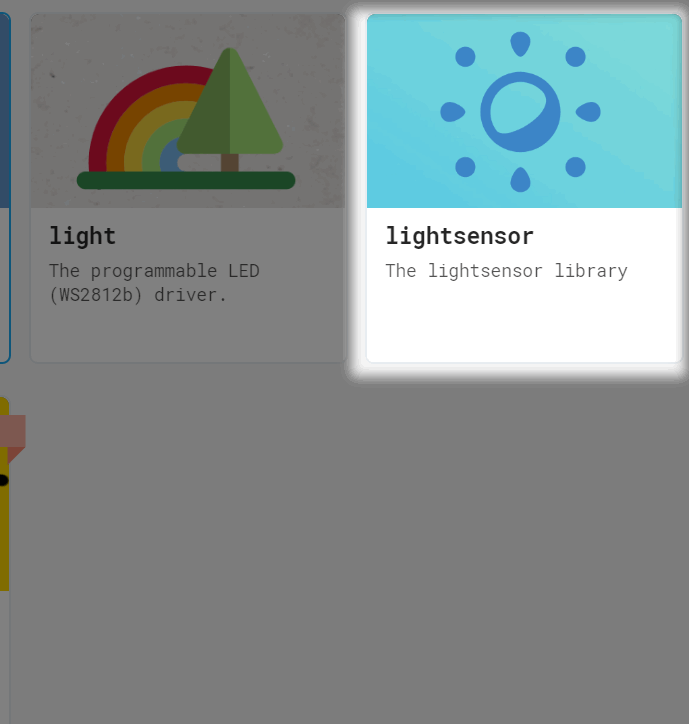
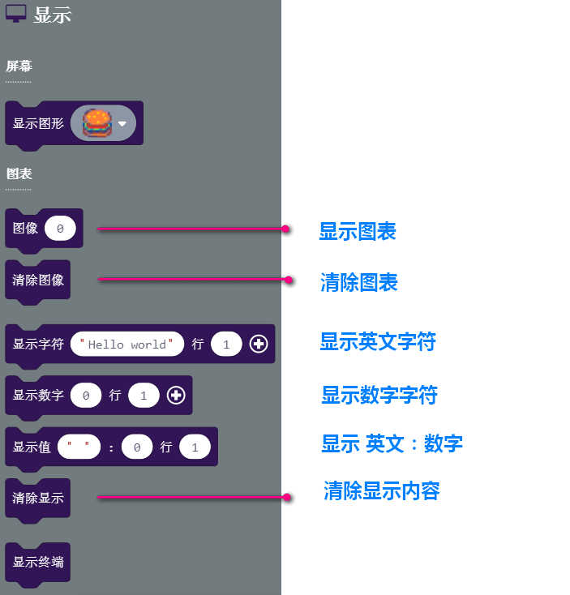
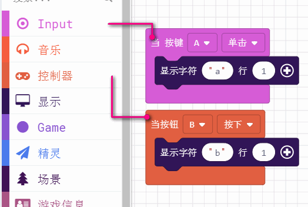
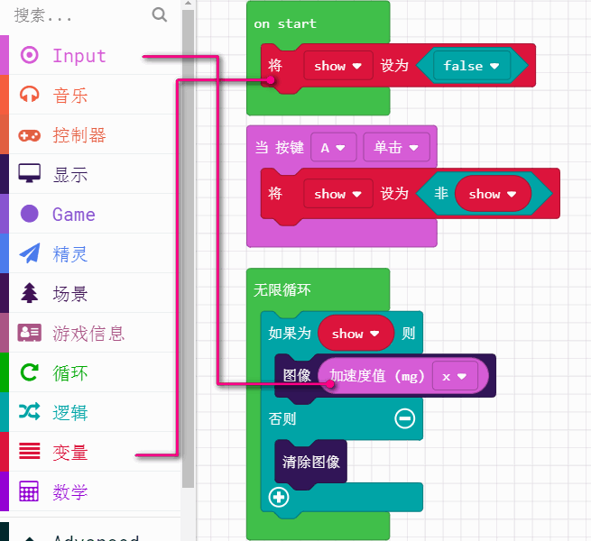
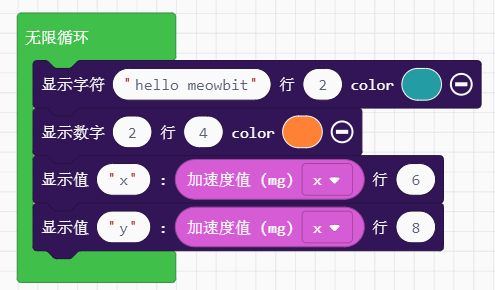

# 彩屏显示控制

喵bit的一大特色就是具有一个160x128的全彩点阵屏，这样我们不用局限在micorbit那个5x5的点阵屏上了，我们可以自由显示中文，还有各种彩色的图形图案了。

## 分栏介绍

## 显示字符串

比micorbit的优势大，就是可以直接在屏幕显示多组数据，也没有microbit那种点阵屏滚动延时。

## 显示中文
这个积木块后续增加...

## 显示图片

直接显示彩色像素图 

当然彩色的图片已经内置了一部分供你快速选择，后面我们也会教大家如何制作自己的图片和让图片显示在何处

## 显示图表

记得我们用Microbit经常要测量一些数据时，我们需要把microbit连上电脑打印出来，现在有了彩屏，也可以直接在屏幕上显示数据，并且看到数据的变化趋势。

