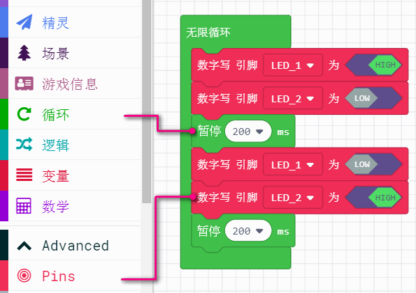

# 按键检测控制

## 喵bit可编程按键介绍

喵bit为了进一步提供用户体验，特意选用了成本比较高的硅胶按键，这种硅胶按键手感比较好，按下去比较舒服。

一共有6个可编程按键

假装这里有个实物图

## 按键分栏介绍

## 按键状态可选

一共4种状态，大家都可以分别测试下这四种方式有什么不同

## 按键类型可选

喵bit上有6个按键（上、下、左、右、A、B）

## 按键测试

我们这里写一个按键AB按键分别按下，播放不同音乐

最后记得下载到喵bit上。分别测试按下A按键或者B按键

本质上喵bit上的按键作用和Microbit的按键是一样的，不同的是喵bit上的按键更多一些，可以对应控制屏幕的精灵角色。按键使用无需消抖动，底层已经集成好消除按键抖动的功能。