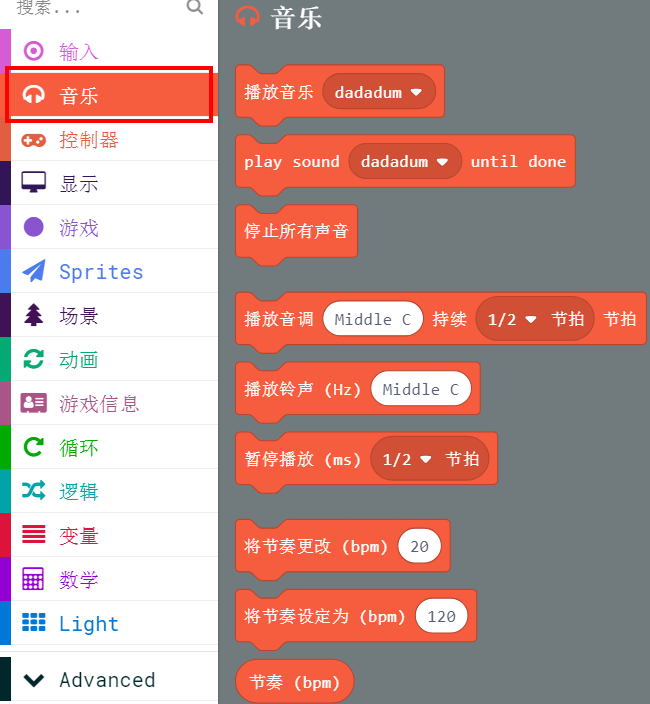
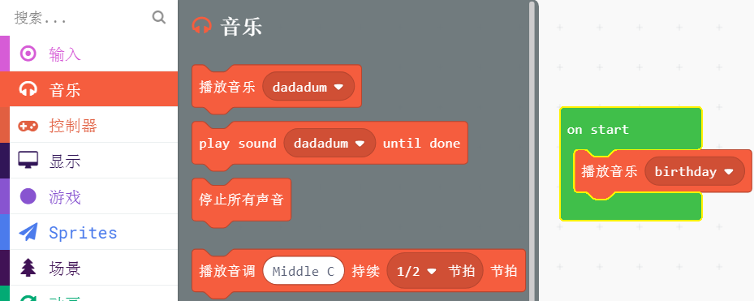

# 蜂鸣器功能

Microbit主板很大遗憾就是没有集成蜂鸣器，因此如果要用到音乐的功能，它必须与扩展版配套使用，或者另外用鳄鱼夹连接音频线进行使用。

?>喵比特完全克服这个缺陷，直接集成了蜂鸣器（作为一个游戏机怎么少得了蜂鸣器呢），使用方法和Microbit的使用方法一样

## 音乐分栏

## 编写一个开机播放音乐的程序

下拉菜单选择自己喜欢的短曲，编写后记得点击下载按钮在板子上执行

