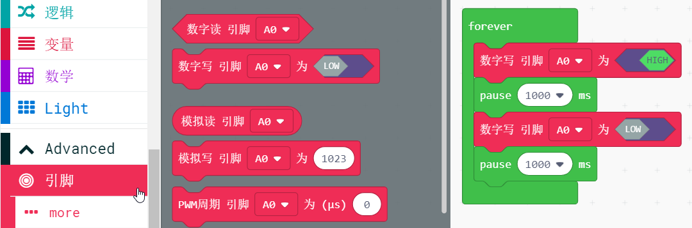
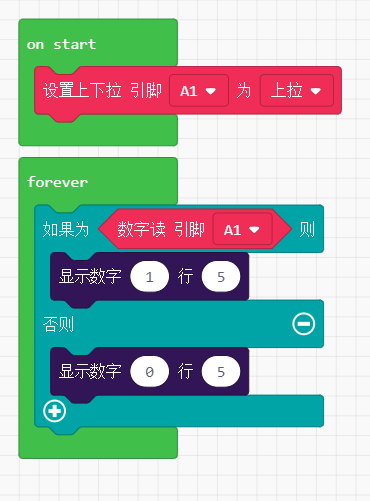
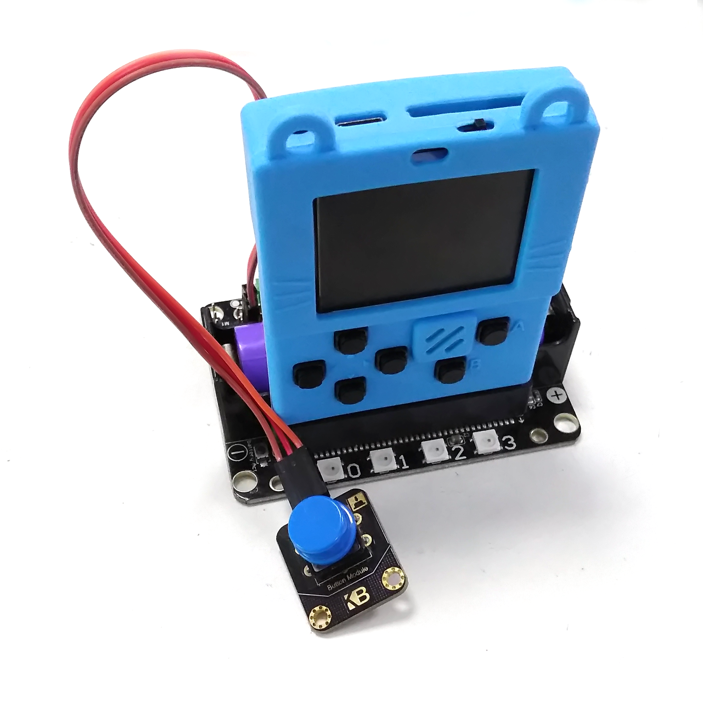

# 引脚直接控制数字传感器

喵bit有多个IO，可以控制多种传感器，通过兼容Microbit的40PIN金手指引出，配合转接板使用，可以非常方便接3PIN传感器。

对于引脚控制，我们一般通过Robotbit或者IObit进行转出进行使用，在外接传感器。

## 引脚定义图

软件改动中，将在下个版本放出最终引脚图...

## 数字写——LED模块

## 数字读——外部按键模块

很多新手用数字读经常会犯的一个问题就是，没有设置上拉！

**如果不设置上拉，按键只能读一次后就失效了。**

设置上拉的意义是，平时把数字脚设置在高电平上，当按键按下时，检测到低电平。

