# 13精灵（角色）创建与设置

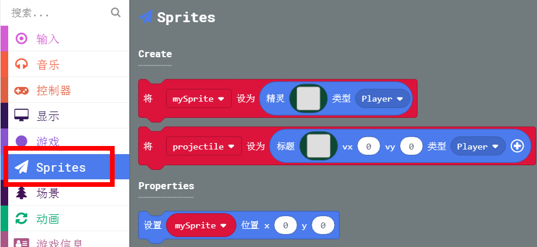

## 创建角色

### 常规角色

角色绘制，直接用画笔完成，也可以用不同颜色的画笔，或者不同粗细

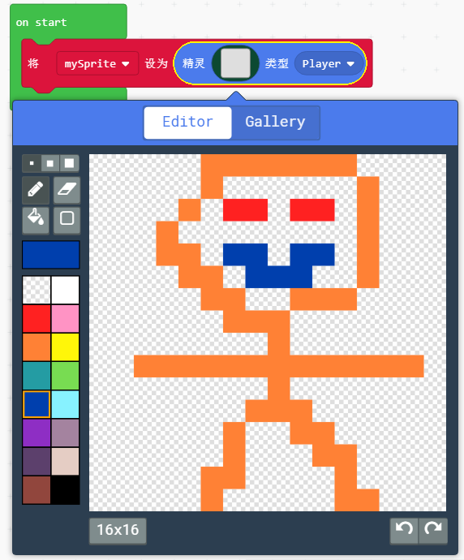

**精灵角色类型：**

一般分为两大类，玩家（就是你自己控制的角色），敌人（作为游戏，肯定会遇到各种各种的敌人，所以把一些角色归类为敌人，在编程上比较好处理）

当然你也可以加入新的类别，便于你自己进行将某些角色做为一类进行操作

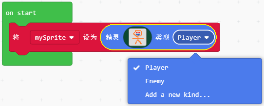

### 抛射体角色

所谓抛射体角色，大家可以理解为，就是做一些基本上有规律运动的角色，例如子弹！这个就是很典型的抛射物体。

例如飞机大战里面，从前头飞来的陨石等障碍物，都是可以归类为抛射物体。

还有一类比较特殊的就是赛车中，往后跑的景色，本质上也是抛射体角色。以车作为参考体，车不动，那么景色就不断向你进行发射。

角色绘制，同理，我这里画了一个炮弹

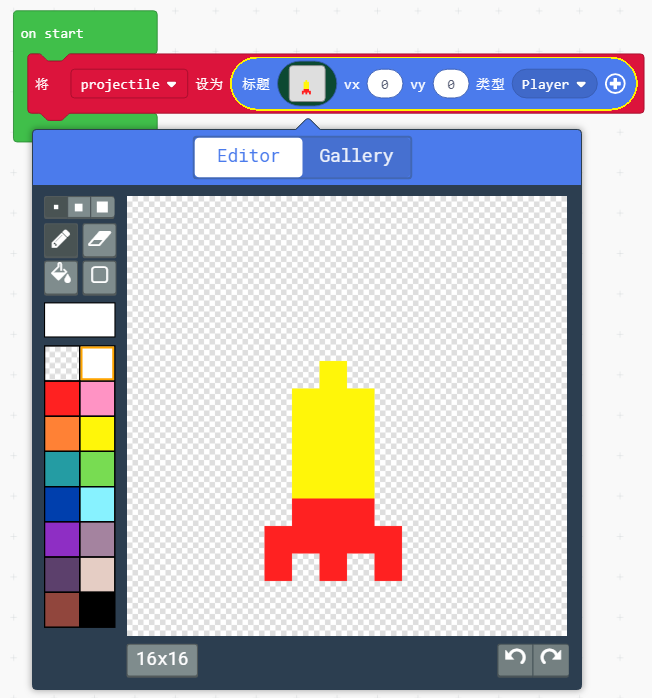

与常规精灵相比，抛射体角色多了一个运动速度，可以设置横向运动

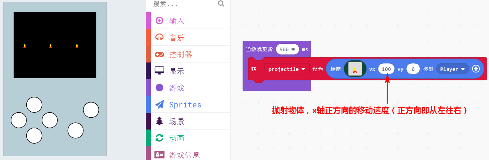

也可以设置成纵向运动，当然横向运动和纵向运动一起设置影响抛射体的移动轨迹也是可以的（例如大风中的雨点就是纵向与横向合成的运动）

点开积木块最后的“+”，可以增加多一个选项栏，这个选项栏是指抛射物从哪里开始发出

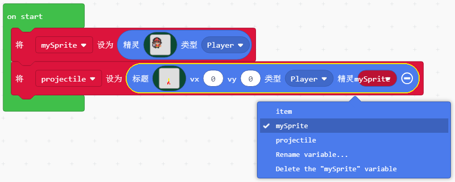

程序更改后，抛射体从角色发出，这时候我们刷新下模拟器就可以看到效果

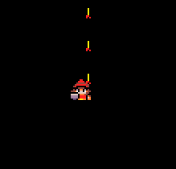

## 角色属性设置

一般创建完角色后，都会设置角色的位置（如果不设置则默认设置为屏幕居中模式）

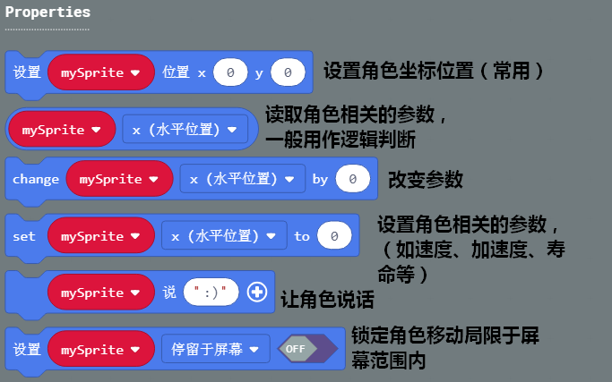

屏幕坐标：

屏幕的坐标一般是左上角为原点

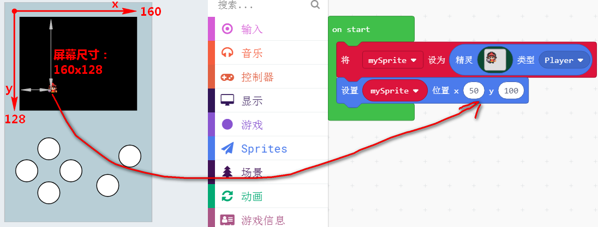

属性一般有几种设置：

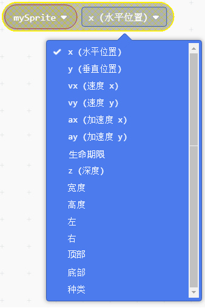

这里重点解释下比较难理解的属性：

*生命期限，就是角色存活的时间，例如肥皂泡泡，一般过个几秒后就会破掉，生命期限以毫秒为单位，一旦到了时间，角色就会立马消失。

*z（深度），如果大家用过PS绘图软件，它里面涉及到了一个图层的概念，前图层会遮盖后图层，包括我们游戏屏幕这边也一样，在同一个位置可能有很多个角色，那么怎么分配他们之间的重叠关系呢。通过设置这个z（深度），数值越负，角色就越往屏幕里面，越深，越是被其它数值大的角色遮盖。

*宽度与高度是指角色的大小宽度与高度】

现在大家对这些属性有点陌生没有关系，当我们后面用作做游戏的时候，这些就会熟练的运用了。

## 角色的碰撞检测

角色碰撞检测这个经常被使用，例如角色碰到怪物生命-1，例如子弹打到敌人，敌人消失等等。

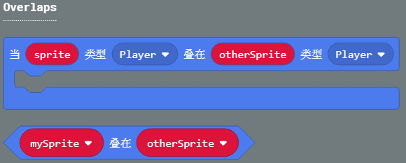

## 角色的创建与销毁

一般就是销毁角色这个积木块用得比较多，当碰撞检测出发后，一般执行就是销毁角色。

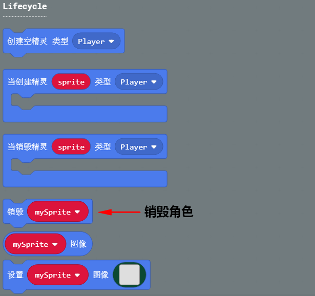

## 特殊积木块“当游戏更新”
上面示例，我们用了游戏机模块特有的积木块，在microbit中是没有的

这个积木块的意思就是让，游戏程序设置了一个闹钟，每当这个闹钟响起就会执行积木块里面的代码。

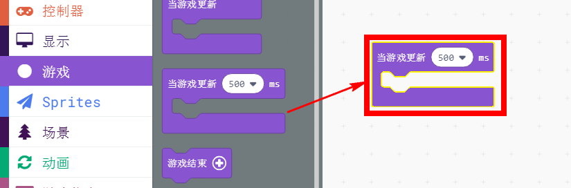

后面的游戏设计，基本上都是用“当游戏更新”这个积木块来取代无限循环+延时

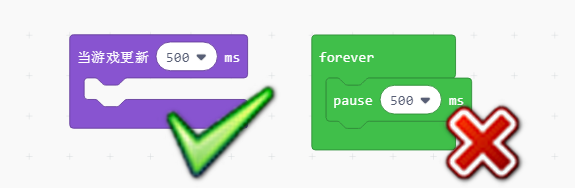

至于为什么，大家可以写两个不同的复杂程序进行测试下，看下它们之间到底有什么不同，你会发现后者用起来会有卡顿的现象，因为pause是指整个系统停止运作500ms

