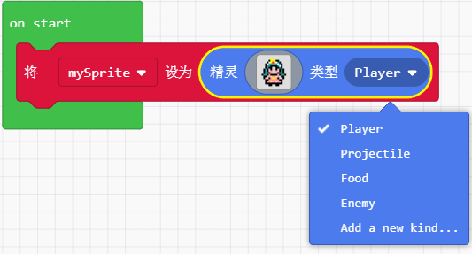

# 13精灵（角色）创建与控制

## 创建角色

### 常规角色

角色绘制，直接用画笔完成，也可以用不同颜色的画笔，或者不同粗细

精灵角色类型：

一般分为两大类，玩家（就是你自己控制的角色），敌人（作为游戏，肯定会遇到各种各种的敌人，所以把一些角色归类为敌人，在编程上比较好处理）

当然你也可以加入新的类别，便于你自己进行将某些角色做为一类进行操作

### 抛射体角色

所谓抛射体角色，大家可以理解为，就是做一些基本上有规律运动的角色，例如子弹！这个就是很典型的抛射物体。

例如飞机大战里面，从前头飞来的陨石等障碍物，都是可以归类为抛射物体。

还有一类比较特殊的就是赛车中，往后跑的景色，本质上也是抛射体角色。以车作为参考体，车不动，那么景色就不断向你进行发射。

角色绘制，同理，我这里画了一个炮弹

与常规精灵相比，抛射体角色多了一个运动速度，可以设置横向运动

也可以设置成，纵向运动，当然横向运动和纵向运动一起设置影响抛射体的移动轨迹也是可以的。

上面示例，我们用了游戏机模块特有的积木块，在microbit中是没有的

这个积木块的意思就是让，游戏程序设置了一个闹钟，每当这个闹钟响起就会执行积木块里面的代码。

后面的游戏设计，基本上都是用这个积木块来取代无限循环+延时

至于为什么，大家可以写两个不同的程序进行测试下，看下它们之间到底有什么不同，你会发现后者用起来会有卡顿的现象，因为pause是指整个系统停止运作500ms

