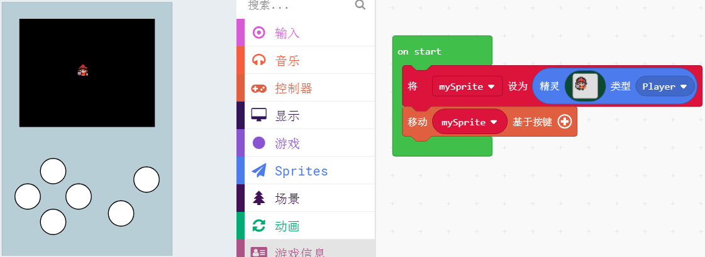

# 14精灵（角色）键盘移动

## 控制器控制角色移动

如果之前你已经用过Scratch图形化编程软件，控制精灵上下左右运动，你至少要做4个积木块组，控制精灵坐标的变动。

而这喵bit的makecode编程对按键移动角色进行了简化。

直接一条积木块指令就可以绑定方向键与精灵

如下图：

用方向键控制，即可控制角色上下左右移动

## 限制角色只能左右或者上下运动

点击基于按键后面的“+”，可以增加多两个选项，用于设置角色的移动速度，

如果设置为0，即限制角色那个方向的速度为0

如果设置为负数，即角色的运动方向与你按键的运动方向刚好是相反的

## 按键触发事件

如果用过Microbit的AB按键，这个积木块就很容易理解了

这里写了一个A按键按下播放音乐的程序

喵bit主控板上可控制的按键会更多了。按键状态也是可设置的。

