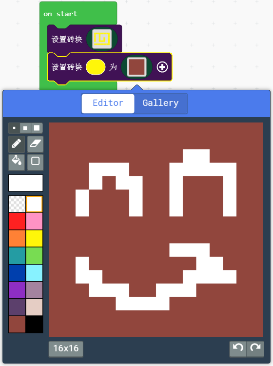
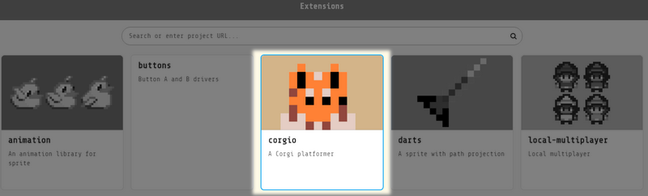

# 场景创建与控制

## 场景背景设置

一般用纯色填充或者用图片填充（大部分小游戏都用纯色填充，甚至不设置背景，就默认为黑色）

选择设置背景图片，可以自己进行背景的绘制，绘制的尺寸大小为屏幕的大小160x128

得到的结果：

## 砖块场景绘制

砖块场景绘制的游戏种类一般就是两种：

1、迷宫类

2、2D平台过关类

常用的积木块就前面两个

如图，这里绘制了一个迷宫砖块地图，并把砖块地图的黄色砖块，设置为棕色独立砖块单元

很多人说，第一个积木块不是绘制了砖块地图了吗？为什么还要设置砖块的形态

看我改造这个程序，讲单独砖块属性设置下。在里面增加一个笑脸，并且把单独砖块设置成棕色。

效果如下图所示，如果让你逐个对砖块进行绘制，估计会疯掉了。

## 多种砖块场景绘制

同理，我们同时可以绘制多种不同的砖块，如果你确实不想砖块太花俏，直接就填充为纯色即可。

## 砖块围墙模式

开启围墙模式后，角色就不能行走墙中，就有了一个移动的限制。这样就无需你再用编程手段去进行移动限制。

## 卷轴式砖块场景绘制

卷轴式砖块场景，在很多2D游戏里面都是必不可少的，首先要把画布切换到32x8的尺寸上

绘制成大概如下的场景

为了简单演示整个卷轴式场景，这里加入了一个小狗的游戏插件

最后代码如下，最后在仿真器中尝试下用方向键（或者WASD键）控制小狗移动，可以控制小狗走完整个场景。这样你就可以看到你绘制的卷轴场景了

