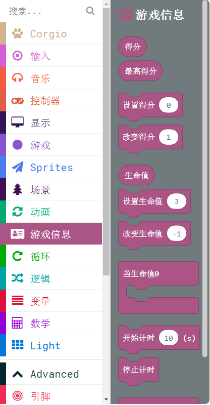
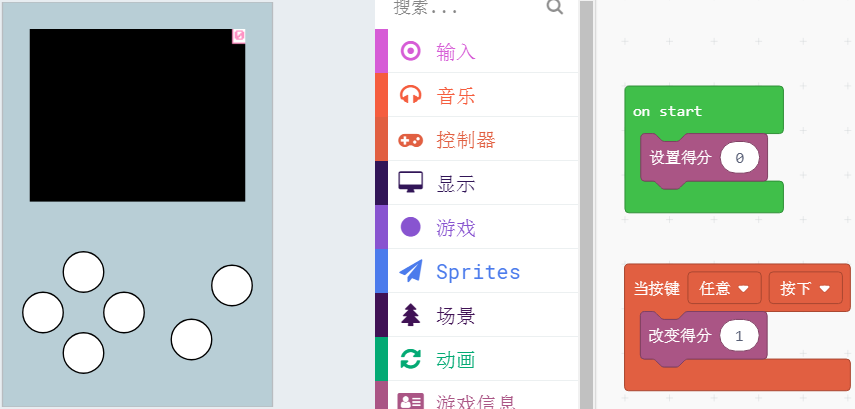
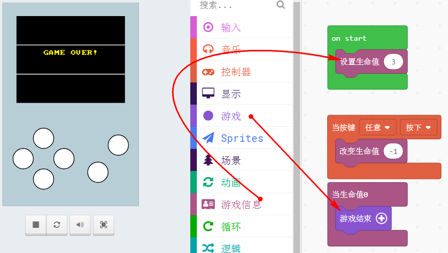
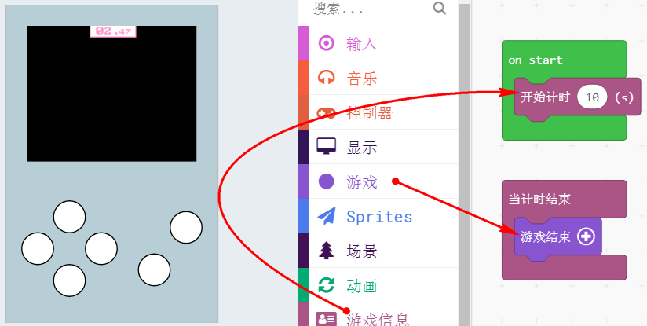

# 常用游戏信息数据创建

一个没有分数统计，或者没有时间限制的游戏是没有灵魂的

## 游戏信息分栏介绍

常用游戏信息有三类：

1. 得分
2. 生命值
3. 倒计时

基本上游戏都脱离不开这三类信息，所以这里干脆做了一个积木分栏，直接将所需要的功能包成所需要的积木块

## 游戏得分

游戏得分显示在左上角上，我们可以根据我们设计的游戏，进行得分增加，例如杀死一个怪物，得一分，或者是拿到一个金币的一分等等

## 生命值

作为一个游戏生命值肯定是少不了，调用了这个积木块后，左上角直接显示当前的生命值，以红心的图标进行显示

## 时间倒计时

在一些时间极限过关类的游戏，直接调用这个倒计时模块，这样就不用自己使用积木块去写这个倒计时积木块了

