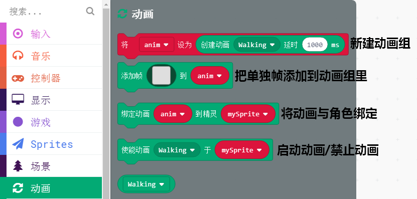

# 17角色动画

在角色控制里面，我们只教了如何移动一个静态的图片，那么通常角色是有一些固定的动作的，例如小狗走动时，有走动动画；角色打怪时，有拔剑对砍的动画。可见动画是少不了的。

## 动画分栏

动画分栏，基本上每次是使用，都会全用上，没有一个是多余的。

## 设置拔剑对砍动画

这里用了内置的角色图片，把帧添加到动作组中。并且做了一个条件判断，当角色移动到屏幕一半以下，就会启动动画，否则停止动画

## 设置多组动画

一个角色肯定不止一个动画，一个角色可以绑定多组动画，设置一些条件进行触发。例如按A键进行跳跃，进行跳跃动画。

如果直接调用动画Idle，一般会停在动画的任意一帧，不符合我们的想法，所以这里特意设置了stop动画，stop动画就一帧，所以只会停止到我们想要的动画内容

