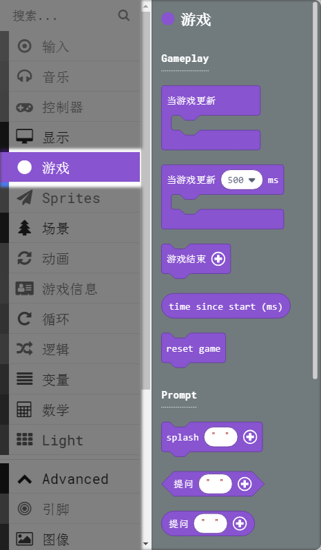
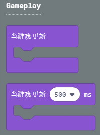
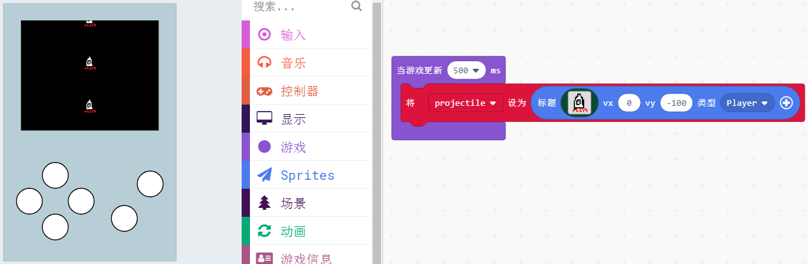
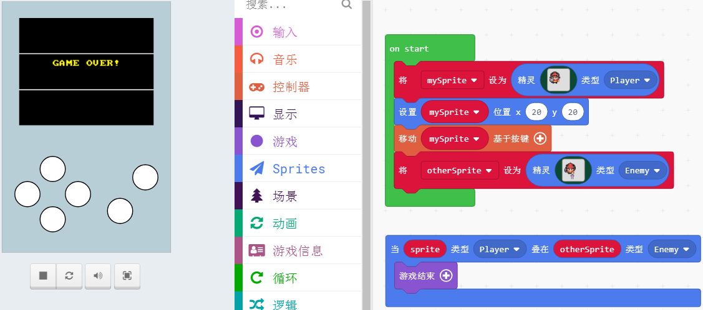
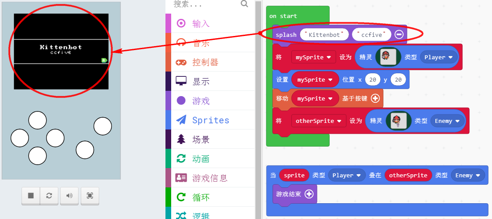
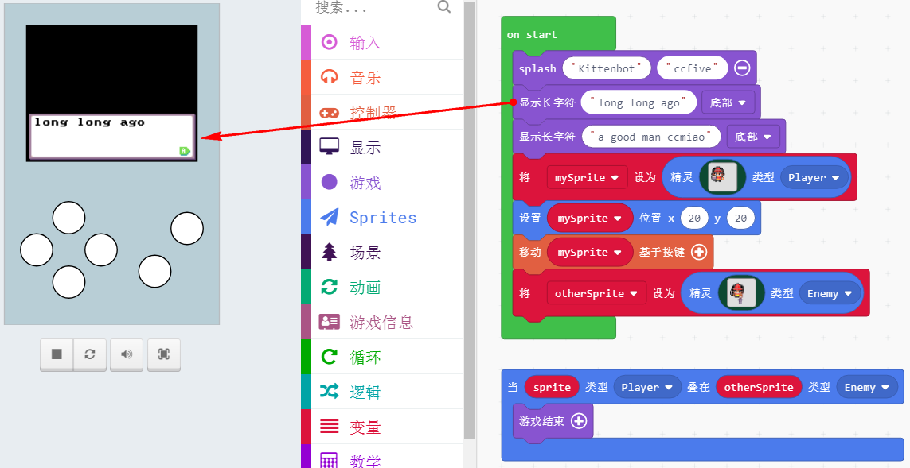

# 18游戏分栏介绍

这个游戏分栏，不知道以什么归类方式进行归类，其中有几个积木块也是比较常用，这里也重点介绍，其余的积木块不怎么常用这里就不展开说，自行进行尝试研究。

## 当游戏更新

这两个游戏积木块实际作用是一样的，一个是无时无刻进行检测，只要游戏有更新就会执行。另外一个是每隔多少秒进行更新。

后者相当于设置了一个闹钟，每次时间一到就执行积木块内的程序。比较适合使用在有规律要求的编程中。例如有时间规律间隔的迎面而来的障碍物。

## 游戏结束

游戏结束这个积木块在任何一个游戏中都会用到，这里编写了一个：玩家精灵角色碰到另外的角色后，游戏就结束。

## 游戏开始大标题

很多游戏加载前，都有一个标题介绍游戏的名称，或者是游戏作者，这里也直接做成了封装积木块

## 游戏对话

游戏对话，直接输入你要显示的内容，一般在故事情节类的游戏中也会经常见到，这里也直接做了封装积木块

