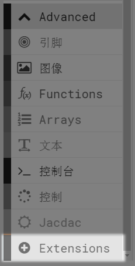
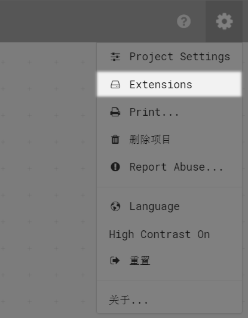
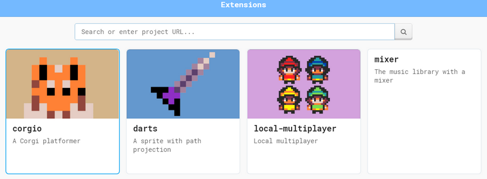
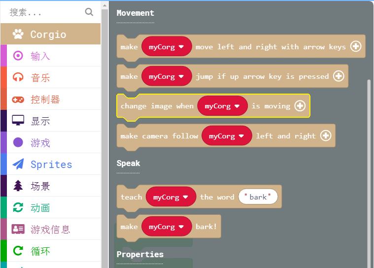

# 19游戏插件扩展

和Microbit的makecode一样，喵bit的makecode也是支持插件扩展的，除了支持硬件插件以外，还支持游戏插件（对特定游戏类型进一步封装），使用了游戏插件后，可以使游戏编程更加简单。

## 加载插件

打开Extensions，有以下两种方法打开：

积木分栏最后一栏：

右上角齿轮点开后：

## 选择插件类别

现在关于游戏的插件有以下四种，第一个小狗插件有所研究，另外三个还每进行学习过

## 插件成功加载

