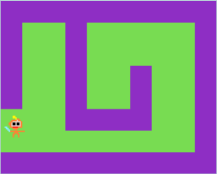
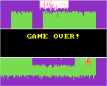

# 20新手上路，创建小游戏

基础的游戏分栏我们都讲解完毕了，从本节开始，我们就开始动手创作自己的游戏了。手把手教你如何从0到1，做出一个游戏，教会你如何思考

## 游戏类型

首先明确我们需要创作一个什么游戏。

CC喵这里想从最简单开始，创建一个走迷宫类的游戏。
方向键控制角色小人移动，当走出迷宫口，就提示游戏胜利。可能游戏不是太精彩，但是毕竟我们从0到1，先尝试下这个简单游戏吧~

## 知识点

精灵角色创建

方向键控制精灵移动

背景颜色设置

背景砖块图绘制

游戏胜利逻辑判断（灵活运用精灵坐标判断）

## 游戏角色

首先我们创建一个精灵角色

绘制你心目中的英雄(请发挥你的艺术细胞)，我是孙悟空，看我的金箍棒~

OK完成了精灵的创建，现在你就是它的爸爸

## 游戏移动控制

尝试用方向键进行控制，好的！你的孙悟空已经活过来了~

## 背景填充

感觉黑色的背景有点单调，我们做一个绿油油的大草原吧~

## 迷宫墙绘制

绘制迷宫墙，并开启墙体开关，否则大圣会“穿墙而过”

迷宫效果图，看上去有点复杂哟，大圣是否能走得出来？

键盘移动角色运动，控制大圣走出门口。基本上游戏已经完成了，但是走出门口是否应该提示游戏成功呢

## 游戏逻辑检测

检测到大圣走到左边的出口，即判断游戏通关成功

最终效果：在胜利的边缘中试探~（是的，门口不够大，特别改大后，再换了个颜色）

## 加个倒计时

为了增加紧张的气氛，设置一个倒计时，倒计时倒数完毕后，如果还没取得通关胜利，那么就gameover了~

最终效果：该死时间快到了，赶紧逃~

哎呀，时间到了，没有走出去

## 加个游戏开始的标题

就叫迷宫吧~作者CCFIVE,属于自己的游戏~

## 总结

基本上做小游戏的整个流程就这样，当然越好玩的游戏，游戏的逻辑上会考虑更多，包括人物与场景的绘制。这个示例只是一个极其简单的示例游戏。后续我们还可以继续改进。

如移动动画，各种音效等~
