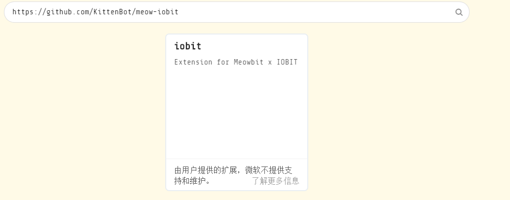
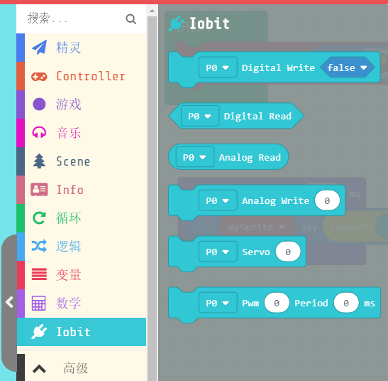
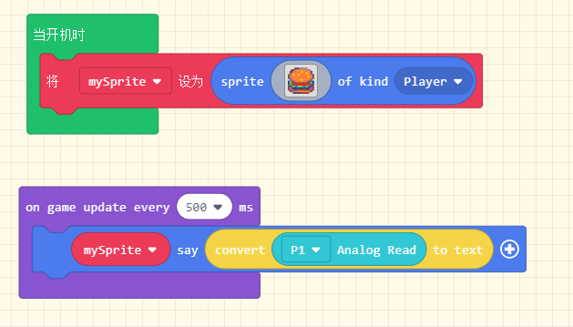
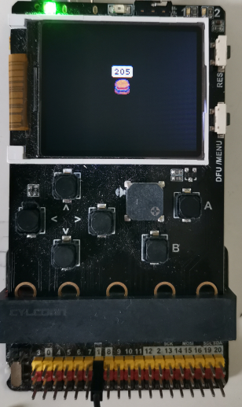

# IOBIT 使用入门

由于Arcade是一个基于游戏的编程平台，所以硬件扩展并不是这个平台的主要方向。因此在短期内不太可能有丰富的硬件扩展，虽然在平台底层继承了microbit类似的io操作接口，但是一般情况下并不开放给用户。这个插件的目的就是提供一系列基于图形化的接口，让大家更加方便的使用喵比特DIY各种硬件和机器人项目。

https://github.com/KittenBot/meow-iobit

## 加载IOBIT插件

1. 首先打开 arcade编程网站：https://arcade.makecode.com/ 并新建一个项目
2. 之后复制插件地址 https://github.com/KittenBot/meow-iobit 
3. 点击积木块最下方的添加扩展件按钮

4. 在添加插件的搜索框部分黏贴进我们插件的github地址，点击搜索自动弹出来插件选项 

5. 插件加载成功后如下图所示：

## IO操作示范

我们先拖入如下图的程序：

之后将其下载到喵比特上：

### PS

由于仿真器并没有对应的IO操作接口，所以如果工作区有IO操作相关的操作运行仿真器可能会报错，大家可以不予理会直接下载到硬件上就行了~

