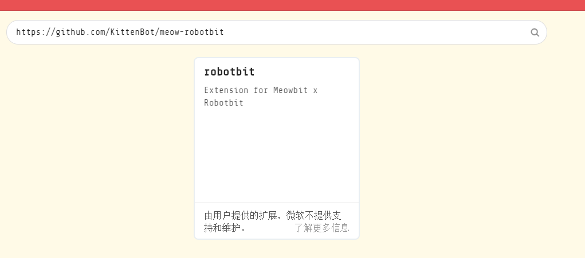
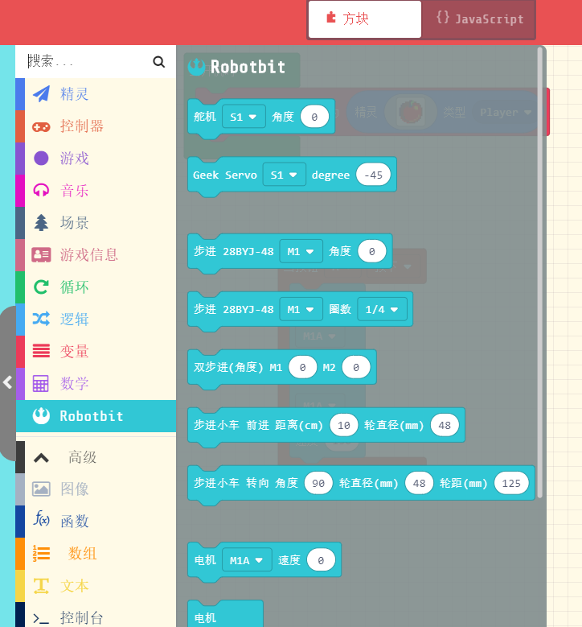
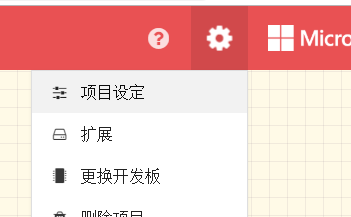
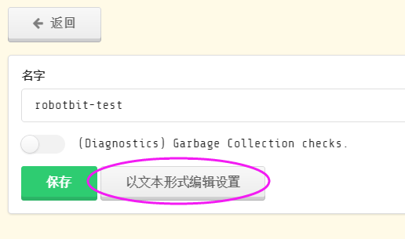
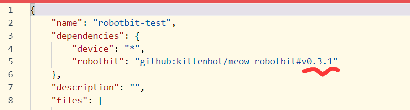

# Robotbit 使用入门

喵比特继承了microbit的40p金手指接口，这也意味着所有小喵家的各种microbit各种外围扩展在喵比特上也能用起来。

## 加载robotbit插件

由于平台差异，microbit上的robotbit插件并不能直接用于喵比特，不过不用担心我们针对arcade做了兼容性的移植。

1. 首先打开 arcade编程网站：https://arcade.makecode.com/，并新建一个项目

2. 之后复制我们github插件链接地址（注意跟microbit的robotbit插件地址区分开）： https://github.com/KittenBot/meow-robotbit

3. 点击积木块最下方的添加扩展件按钮

4. 在添加插件的搜索框部分黏贴进我们插件的github地址，点击搜索自动弹出来插件选项 （目前还不是官方外围插件列表中）

5. 点击加载插件就可以看到加载进来的插件了

## 如何更新robotbit插件版本

一般来说新导入插件就是最新版本的robotbit插件，大家可以在下面地址看到最新喵比特robotbit插件更新情况

https://github.com/KittenBot/meow-robotbit/releases

但是万一插件更新了，但是你的项目内插件没更新怎么办呢？这时候就需要手动升级了。。

1. 首先点击右上角小齿轮打开项目设定

2. 之后选择以文本模式编辑

3. 将插件的版本号改成最新的，注意不要填错。之后点击返回就会自动重新下载最新的插件了~

## FAQ

* RGB彩灯在arcade为内置插件，目前先从`meow-robotbit`中移除了，具体参考我们其他关于rgb彩灯的教程。

### PS

*由于arcade目前处于快速迭代开发的阶段，如果发现程序用不了可以试试beta版本 https://arcade.makecode.com/beta *

