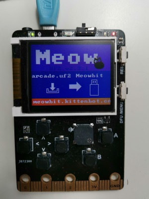
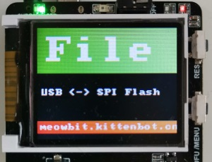
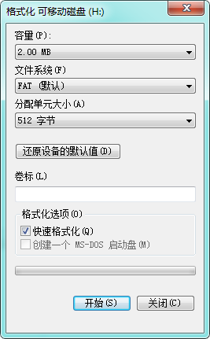

# 喵Bit 平台更新文档 2019年2月

**适用对象：天使用户和2019春节用户**

非常感谢喵bit的天使用户和春节前后购买的用户对该产品的喜爱，我们收集了大量的反馈并对平台做出很多优化，并在2019元宵节迎来喵bit的第一次平台更新。

## 更新步骤

**请大家仔细跟着下面步骤一步步更新喵bit**

* 下载带新的BootLoader的dfutil：[http://cdn.kittenbot.cn/meowbit/dfutil.zip](http://cdn.kittenbot.cn/meowbit/dfutil.zip)
* 按住dfu按键将喵bit连接到电脑，让meowbit进入dfu模式。具体可以参考我们固件更新文档（这也可能是您最后一次使用dfu模式更新固件了）
* 解压dfu工具，点击`BootLoader.bat`脚本更新BootLoader。刷新完成后按reset会进入BootLoader更新提示框
* 使用下按键选择最后一项并按A按钮进行BootLoader刷新，完成后请再次复位。
* 更新成功后会出现全新的BootLoader界面, 如下图

* 下载新的字库文件: [http://cdn.kittenbot.cn/meowbit/unicode12.bin](http://cdn.kittenbot.cn/meowbit/unicode12.bin)
* 按住键盘方向键左按钮，之后按侧边的reset按钮，等待喵bit重启并进去spi-fs模式。

* 第一次进入该模式window可能会提示需要格式化，请注意将其格式化为fat格式

* 格式化完成后将上面的`unicode12.bin`复制到u盘上就行了。

## Micropython模式更新

更新了新的BootLoader之后，进入micropython模式也不需要重新进入dfu模式切换固件了

* 下载Micropython的uf格式固件：[http://cdn.kittenbot.cn/meowbit/meowpy.uf2](http://cdn.kittenbot.cn/meowbit/meowpy.uf2)
* 直接使用`meowpy.uf`拖到喵bit的u盘盘符下就行了~