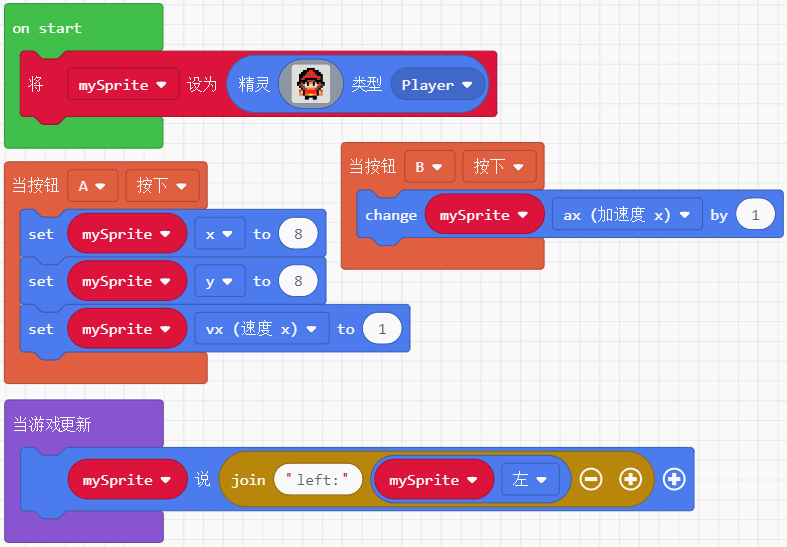
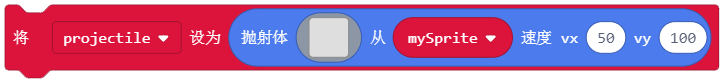
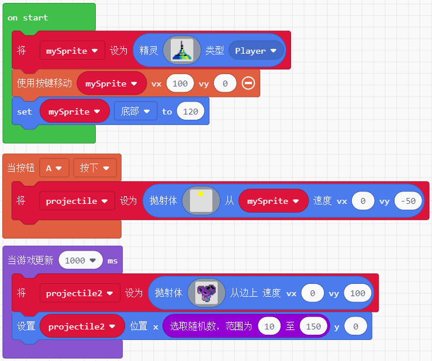
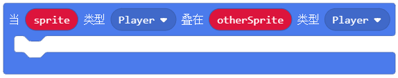
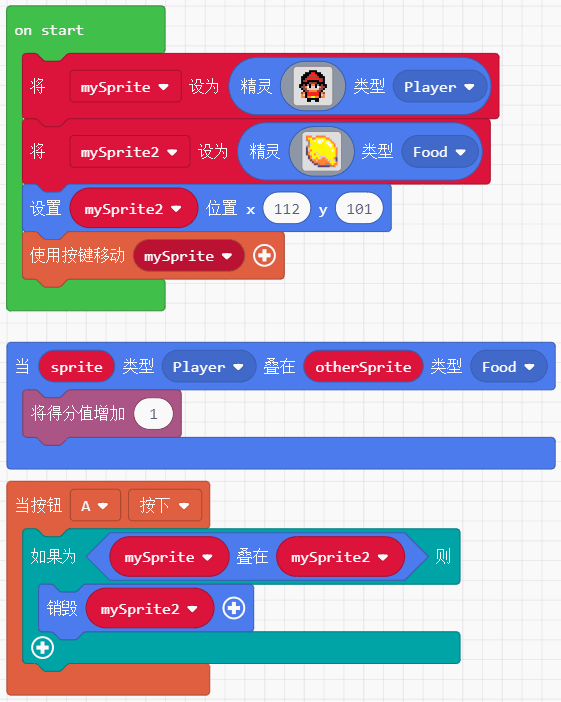

# makecode分栏积木块介绍  

## 音乐  

### 声音  

控制内置音乐的播放及停止

  

默认音量128（0~255）,可在on start下设置音量 
  
 

---  

### 音律  

**音调**  

可以选择给定钢琴调，也可自行拖拽Hz积木块

    

---  
**节拍**   

BPM是Beat Per Minute的简称，中文名为拍子数，释义为每分钟节拍数的单位  

   

---  

例子：按下B键播放一段惊心动魄的急促音效  

   

---
## 控制器  

一个积木块实现将精灵的移动联系到键盘的方向键。

 

```javascript
function moveSprite(sprite: Sprite, vx: number = 100, vy: number = 100);  
```   

例子： 

  

---
用于检测按键按下的两种方式  

 

```javascript
onEvent(event: ControllerButtonEvent, handler: () => void);  
isPressed(); //(返回:boolean)
```  

例子： 

 

---  
用于单独控制精灵x和y轴的移动
   

```javascript  
function dx(step: number = 100);    
function dy(step: number = 100);  
```  

例子： 

   

---  

## Game  

### Gameplay  

**游戏中地位相当于main函数**  

游戏中当精灵创建，销毁，重叠或碰撞时有可用于运行代码的事件。而当你希望定期来控制游戏中的某些事情时，你需要用到下面两个积木块。这两个积木块的区别是前者(更新频率由游戏引擎决定)几乎是无时无刻在执行，而后者则相当于定时器，每隔一定时间就执行一次。

  

```javascript  
//a：需要运行的代码，period:希望间隔运行代码的时间(毫秒)
function onUpdate(a: () => void): void; 
function onUpdateInterval(period: number, a: () => void): void;

//游戏循环的一个大致代码描述 
while (!gameOver) {
    checkInputs()
    gameUpdate()
    showGameUpdates()
}
```

例子： 

  

---  
游戏结束积木块，它的作用是用于结束整个游戏循环

  

```javascript  
//win：可选true或false用于显示到屏幕上玩家获胜与否，effect?:游戏结束时在背景显示内置特效
function over(win: boolean = false, effect?: effects.BackgroundEffect);
```  

例子：  

  
  
---      
得到一个自从游戏程序开始运行的时间(单位是ms)

  

```javascript
//number:记录从游戏开始以来的毫秒数  
function runtime(): number; 
```    

---   
重置游戏，恢复如初，从on start内容开始再执行
  
  

```javascript  
function reset();
```  

例子：  

 

---  

### 提示(询问)  

用于在屏幕中间显示标题和副标题

   

```javascript  
//subtitle显示在title下一行，且只能显示小于8px，故无法显示中文
function splash(title: string, subtitle?: string);
```  
> [!NOTE|style:flat]
> 此积木块可以显示中文，需要额外添加设置字体大小的积木块，并设置为12px。12px字体下，请误使用副标题

例子： 

   

---  

该积木块返回一个boolean，与逻辑判断积木块结合使用，当触发积木块后，玩家按A返回true，按B则为false。

  
  
```javascript  
function ask(title: string, subtitle?: string): boolean;  //如同显现积木块那样可以描述两行
// 返回一个boolean

```  
> [!NOTE|style:flat]
> 但此积木块不可显示中文。

例子：

    

---  
  
提问窗口，窗口下可输入字符进行回复，通过逻辑判断积木块来判断玩家输入的字符串是否为某个字符串进而执行特定程序。

  

```javascript   
function askForString(message: string, answerLength = 12);  
//message:提问的问题(字符串)， answerLength：可让玩家输入的字符个数(默认不选为12)
//返回值为玩家输入的字符串
```

> [!NOTE|style:flat]
> 但此积木块不可显示中文。

例子：0-10随机加法题

  

---  

### 对话框  

显示长文本功能作为对话框可能会频繁使用，对话框以后的积木块就不做详解，比较冷门。

 

```javascript
//str:你设计好的对话内容，layout：有left、right、top、bottom、center、full screen六种位置选择。  
function showLongText(str: string, layout: DialogLayout);
```  

---  

## 场景

### 屏幕  

得到并返回屏幕的像素宽和高 (喵比特是160x128)


```javascript
function screenWidth(): number;
```   

例子：  


---  

背景颜色的设置和获取  


```javascript
function setBackgroundColor(color: number); //设置背景颜色，颜色用0-15来表示
function backgroundColor() : number;  //获取颜色数值，未设置默认为0
```

例子：黑白背景切换实现闪屏  


--- 


  

```javascript
function setBackgroundImage(img: Image);  // img：作为设置背景的图片
function backgroundImage(): Image; //返回设置的背景图
```    

> [!NOTE|style:flat]
> 结合`图像`积木块，该分栏位于Advanced下。

例子：实现左右背景颜色每500ms交替  

   

---  

### 特效  
  
增加游戏体验，特效分别用于游戏中和游戏结束结果为win时  


    
  
例子：   
  
  

--- 

### 砖块  
  
游戏场景中包含砖块这个要素，它主要的功能在于奠定游戏的大场景，拥有物理特性。


 

```javascript  
function setTileMap(map: Image);  //map：通过颜色代号构建一个砖块场景，与屏幕中的像素比为1:16
function setTile(index: number, img: Image, wall?: boolean);  
//index:用于构建砖块的颜色代号，img：用于布置砖块的图案，collisions：(boolean)值为false时，精灵能够穿越砖块，为true时精灵将被砖块阻挡既生成物理碰撞
```   

例子：   

   

---  

下列两个积木块可结合使用，用于定位并替换砖块


   

```javascript  
//col、row:通过行和列来定位砖块  返回砖块在场景图中的位置，左上角为起始点0，0  
function getTile(col: number, row: number): tiles.Tile;  

//title:要替换的砖块对象， index：一个值用于替换之前的颜色代号
function setTileAt(tile: tiles.Tile, index: number);
```  

例子： 自上而下自左向右铺满红色砖块

   

---  

用于相同颜色索引的砖块批量替换

  

```javascript   
//index：一个颜色索引值  
//返回在砖块地图中具有相同颜色索引值的砖块数组  
function getTilesByType(index: number): tiles.Tile[];  
```  

例子：  

    

---  

可以将精灵准确的放置在砖块地图上的随机一个砖块位置上，通过颜色索引值去限制精灵所能匹配的砖块颜色类型  

   

```javascript  
//sprite：需要移动放置在砖块位置上的精灵， color：需要制定随机砖块的颜色索引
function placeOnRandomTile(sprite: Sprite, color: number): void;
```  

例子：设置一个有4中颜色索引的砖块地图，并且让绿色小精灵能够随机落在他们其中一个上    

     

---  

   

```javascript
//sprite：要移动到砖块上的精灵
place(mySprite: Sprite): void;
```
  
例子： 

  

---  

当精灵撞到指定的砖墙时，运行一些代码程序

   

```javascript
//kind：用于检测撞到墙的精灵类型，type：墙的类型(颜色索引)，handler：当有精灵碰到墙要执行的程序(sprite)：撞到墙的精灵
function onHitTile(kind: number, tile: number, handler: (sprite: Sprite) => void);
```

例子：当精灵碰到红色索引的墙，说一句 oh！

  
  

---  

两者都属于通过设置碰撞方位后，触发返回值类型的积木块，不同点在于：
- 前者返回为boolean
- 后者返回砖块索引值为数字


```javascript
isHittingTile(direction: CollisionDirection): boolean;  //返回值为boolean  
tileHitFrom(direction: CollisionDirection): number;     //返回值为砖块索引值 
//direction：发生碰撞时砖块位于精灵的方向：left, right, top, or bottom，
```

例子1：自由控制精灵移动，当撞到四面的墙分别说出对应的方位

  

例子2：设置两种索引值的砖块，当精灵分别碰到他们时说出对应的索引值

   

--- 

该积木块属于特效积木块，在遇到危险或发生碰撞事件时以震动来增强游戏体验

  

```javascript
//amplitude：震动的最大像素偏移量，duration：震动持续时间
function cameraShake(amplitude: number = 4, duration: number = 500);  
```

例子：同时设置精灵，背景和砖块，可以看出背景是不受震动影响的

  

---  

改变镜头的定位，不在使镜头一味停留在160x128的居中值。


  

```javascript 
function cameraFollowSprite(sprite: Sprite);  
//sprite：需要镜头跟随的精灵
function centerCameraAt(x: number, y: number);
//x,y：需要让镜头锁定的坐标数值
```

例子1：镜头跟随精灵移动，每当精灵撞到墙就翻转运动

  

例子2：画砖块地图的时候我们选择16x16像素的画布，实际得到的场景尺寸则为256x256，然后我们在中间画上一个方形砖块图，镜头每隔1s会随机锁定范围内的一个坐标

   

---  

## 精灵  

### 创建  

用于创建游戏中最基础的精灵(角色)

   

```javascript
//img：用于创建精灵的图像，kind：精灵的随意一个类型。返回一个包含图案的精灵
function create(img: Image, kind?: number): Sprite; 
```

### 物理  

设置精灵的基本物理属性：位置，速度

 
  

```javascript
//x,y：屏幕上精灵的新水平竖直的中心位置
//vx，vy：精灵的水平和竖直速度(像素/s)
setPosition(x: number, y: number): void;  
setVelocity(vx: number, vy: number): void;  
```

例子：

  

---  

如下三个积木块分别用于精灵属性的取值，改变值，设置值。

  

  

这个积木块包含下拉框许多可选属性，除了基本的x，y坐标，其他的属性依次为 

  

- vx、vy：xy轴速度
- ax、ay：xy轴加速度
- 生命值：(这里实际指的是生命周期)：既精灵能够存在的时间单位是s
- z(深度)：既一个前后关系，数值越大显示层级越前
- 宽度高度：精灵像素的大小
- 左、右、top、底部：表示精灵分别距离这四个方向的像素值(左上角为0,0)

例子：按下按键A让精灵位置到左上角，并且给一个横向速度vx=1pixel/s，按下B可以将原本为0的ax加1，反复按下效果等价于ax = ax + 1，同时精灵会一直说与左边界的距离

 

---  

### 特效  

一下两个积木块用于给精灵添加特效和消除精灵特效

 
 

例子：按下A B键分别给精灵加特效和取消特效  

 

---  

可以将精灵从游戏中消除，这样便无法使用该精灵的任何属性了。

  

```javascript
//effect:一个可选的内置特效
destroy(effect?: effects.ParticleEffect, duration?: number);
```

例子：可点+号增加销毁特效  

    


---  

这是一个让精灵说话的积木块，会在精灵的头顶上生成一串字符串

     

```javascript
//text：值允许是字符串，timeOnScreen：说话框存在时间，textColor、textBoxColor：使用0-15的索引值分别表示字体颜色和说话框颜色。
say(text: string, timeOnScreen?: number, textColor = 15, textBoxColor = 1);
```

例子：说的4种支持方式

  

---  

规定精灵的一些特性

 

```javascript
setFlag(flag: SpriteFlag, on: boolean);
```


可选的选项分别表示：
- 停留于屏幕：让精灵只能处于160*128的屏幕内(可以配合镜头跟随积木块一起使用)
- 幽灵：编程幽灵的精灵无法发生物理碰撞和触发任何碰撞事件
- 自动销毁：变成幽灵的精灵走出屏幕范围后悔自动销毁
- 碰到屏幕边缘销毁：字面意思，当碰到地图边缘就会销毁
- 碰到屏幕边缘反弹：碰到屏幕边缘就反弹(既无法超出屏幕范围) 
- 显示坐标与速度：在精灵底部显示他的坐标和速度  

--- 

### 抛射物  


  

```javascript
//img：用于创建精灵的图案，vx、vy：精灵在屏幕中的运动速度，sprite：一个精灵实例
function createProjectileFromSide(img: Image, sprite?: Sprite, vx: number, vy: number);  
function createProjectileFromSprite(img: Image, vx: number, vy: number);
```

例子：

  

--- 

### 重叠 

当规定的两种类型精灵相互重叠时，可以执行某些程序，前者触发后可以进入内部执行，后者常常跟逻辑语句结合使用，返回值是boolean

  
  

```javascript
function onOverlap(kind: number, otherKind: number, handler: (sprite: Sprite, otherSprite: Sprite) => void);
function overlapsWith(sprite:Sprite)
```

例子： 

 

<!-- > [!NOTE|style:flat]
> An alert of type 'note' using alert specific style 'flat' which overrides global style 'callout'. -->