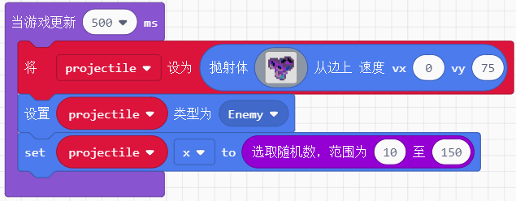
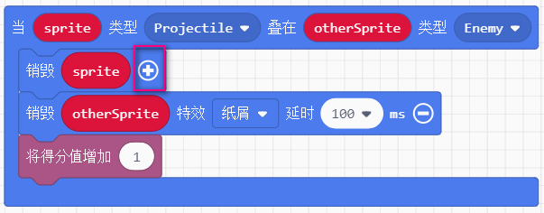
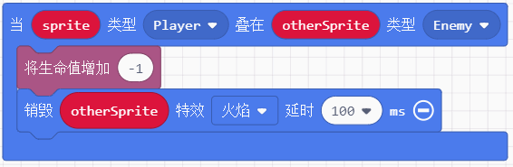

# 第九节：认识抛射物 {docsify-ignore-all}  
  
前面的章节已经将游戏基本三要素中的其二：精灵、场景 进行了讲解，这节课我们开始认识最后一个要素： 
`抛射物`  
抛射物顾名思义，它的基本属性便是运动，它在游戏中常见的形态就是飞机大战中的障碍物、飞机发射的子弹诸如此类。  
  
这节课我们的目标就是完全认识抛射物这个概念并能够熟练使用，为了完成这个目标我们制作一个  
`飞机打陨石`的小游戏  

我们完成游戏的大致流程概述如下  
1. 新建飞机这个精灵，使其可以控制，并固定位置  
2. 游戏中存在两种抛射物，一个是飞机的子弹，一个是太空陨石，我们给他们设置一些属性
3. 最后是用到上一节学到的重叠事件，当子弹碰到陨石，当陨石碰到飞机各会发生什么  
  
## 要点1：创建飞机
  
飞机造型直接选择就好。需要将飞机限制在可视屏幕范围内，同时固定于屏幕底部且只能横向移动，根据需要首先初始化飞机的生命值。  

  
  
## 要点2：抛射物创建

抛射物区分成2种，陨石和子弹。 创建积木块分别使用两种    
  
 
**1. 子弹的创建**

子弹通过按下按键A，从飞机处发射  
  
   
  
  
**2. 陨石的创建**  
  
陨石是固定时间间隔从屏幕上方出现。这种有规律的间隔我们一定不使用`暂停`这类积木块，因为游戏中的图像每时每刻都在刷新，而暂停这类延时功能会让整个游戏全部停下来等待。所以我们使用当游戏更新这个积木块，作为定时器只有当时间到的时候才做出必要更新。

  

!?将陨石类型设置为敌人是为下接下来重叠事件的区分


  

## 要点3： 碰撞反应  

使用如下积木块，我们根据类型区别为飞机子弹碰到陨石、陨石碰到飞机这两种时间  

**1. 飞机子弹碰撞陨石**

此时需要的是抛射物类型和敌人类型相碰。  

!>当子弹以抛射物积木块创建时，默认的类型便是抛射物(projectile) 
另外，图中的销毁对象为sprite和otherSprite而不是它的创建对象名。
  
  

细心的同学可能发现了，在销毁积木块的后面有个加号，我们点开以后是特效，在此我们给个参数后便来验证一下  
  
  
  
**2. 陨石碰撞飞机**  

运用上面的经验，我们很容易搭出这个事件功能，增加的一点是当陨石触碰飞机生命是是要减少的。
 
  

## 任务完成 
  
  

```javascript  
enum SpriteKind {
    Player,
    Projectile,
    Enemy,
    Food
}
let projectile: Sprite = null
let ship: Sprite = null
let otherSprite: Sprite = null
let sprite: Sprite = null
sprites.onOverlap(SpriteKind.Player, SpriteKind.Enemy, function (sprite, otherSprite) {
    info.changeLifeBy(-1)
    otherSprite.destroy(effects.fire, 100)
})
sprites.onOverlap(SpriteKind.Projectile, SpriteKind.Enemy, function (sprite, otherSprite) {
    sprite.destroy()
    otherSprite.destroy(effects.confetti, 100)
    info.changeScoreBy(1)
})
controller.A.onEvent(ControllerButtonEvent.Pressed, function () {
    projectile = sprites.createProjectileFromSprite(img`
        . . . . . . . .
        . . . . . . . .
        . . . . . . . .
        . . . . . . . .
        . . . 7 7 . . .
        . . . 7 7 . . .
        . . . 7 7 . . .
        . . . 7 7 . . .
    `, ship, 0, -140)
})
ship = sprites.create(sprites.space.spacePinkShip, SpriteKind.Player)
controller.moveSprite(ship, 100, 0)
ship.bottom = 128
ship.setFlag(SpriteFlag.StayInScreen, true)
info.setLife(3)
game.onUpdateInterval(500, function () {
    projectile = sprites.createProjectileFromSide(img`
        . . . . . . . . . . . . . . . .
        . . . . . . . . . . c c c c . .
        . c c c c c . c c c c c f c c .
        c c a c c c c c 8 f f c f f c c
        c a f a a c c a f f c a a f f c
        c a 8 f a a c a c c c a a a a c
        c b c f a a a a a c c c c c c c
        c b b a a c f 8 a c c c 8 c c c
        . c b b a b c f a a a 8 8 c c .
        . . . . a a b b b a a 8 a c . .
        . . . . c b c a a c c b . . . .
        . . . . b b c c a b b a . . . .
        . . . . b b a b a 6 a . . . . .
        . . . . c b b b 6 6 c . . . . .
        . . . . . c a 6 6 b c . . . . .
        . . . . . . . c c c . . . . . .
    `, 0, 75)
    projectile.setKind(SpriteKind.Enemy)
    projectile.x = Math.randomRange(10, 150)
})

```  

**这节课我们学到了什么？**
- 抛射物的概念和如何创建抛射物 
- 例子中的抛射物是自上而下的陨石，如果我们需要横向移动的障碍物该如何做呢？
