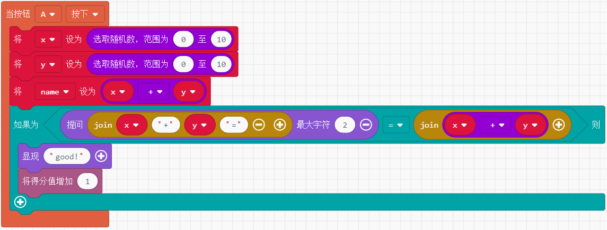

# Game  

## Gameplay  

**游戏中地位相当于main函数**  

游戏中当精灵创建，销毁，重叠或碰撞时有可用于运行代码的事件。而当你希望定期来控制游戏中的某些事情时，你需要用到下面两个积木块。这两个积木块的区别是前者(更新频率由游戏引擎决定)几乎是无时无刻在执行，而后者则相当于定时器，每隔一定时间就执行一次。

  

```javascript  
//a：需要运行的代码，period:希望间隔运行代码的时间(毫秒)
function onUpdate(a: () => void): void; 
function onUpdateInterval(period: number, a: () => void): void;

//游戏循环的一个大致代码描述 
while (!gameOver) {
    checkInputs()
    gameUpdate()
    showGameUpdates()
}
```

例子： 

  

---  
游戏结束积木块，它的作用是用于结束整个游戏循环

  

```javascript  
//win：可选true或false用于显示到屏幕上玩家获胜与否，effect?:游戏结束时在背景显示内置特效
function over(win: boolean = false, effect?: effects.BackgroundEffect);
```  

例子：  

  
  
---      
得到一个自从游戏程序开始运行的时间(单位是ms)

  

```javascript
//number:记录从游戏开始以来的毫秒数  
function runtime(): number; 
```    

重置游戏，恢复如初，从on start内容开始再执行
  
  

```javascript  
function reset();
```  

例子：  

 

---  

## 提示(询问)  

用于在屏幕中间显示标题和副标题

   

```javascript  
//subtitle显示在title下一行，且只能显示小于8px，故无法显示中文
function splash(title: string, subtitle?: string);
```  

!>此积木块可以显示中文，需要额外添加设置字体大小的积木块，并设置为12px。12px字体下，请误使用副标题

例子： 

   

---  

该积木块返回一个boolean，与逻辑判断积木块结合使用，当触发积木块后，玩家按A返回true，按B则为false。

  
  
```javascript  
function ask(title: string, subtitle?: string): boolean;  //如同显现积木块那样可以描述两行
// 返回一个boolean

```  
<!-- > [!NOTE|style:flat] -->
!>但此积木块不可显示中文。

例子：

    

---  
  
提问窗口，窗口下可输入字符进行回复，通过逻辑判断积木块来判断玩家输入的字符串是否为某个字符串进而执行特定程序。

  

```javascript   
function askForString(message: string, answerLength = 12);  
//message:提问的问题(字符串)， answerLength：可让玩家输入的字符个数(默认不选为12)
//返回值为玩家输入的字符串
```


!>但此积木块不可显示中文。

例子：0-10随机加法题

  

---  

## 对话框  

显示长文本功能作为对话框可能会频繁使用，对话框以后的积木块就不做详解，比较冷门。

 

```javascript
//str:你设计好的对话内容，layout：有left、right、top、bottom、center、full screen六种位置选择。  
function showLongText(str: string, layout: DialogLayout);
```  

---  