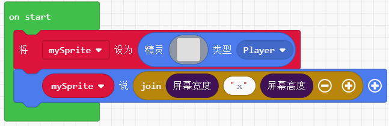
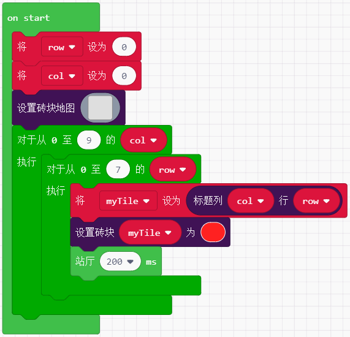
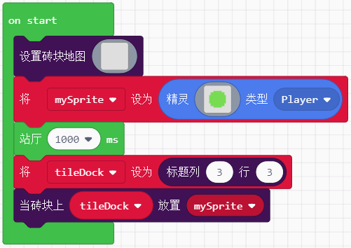
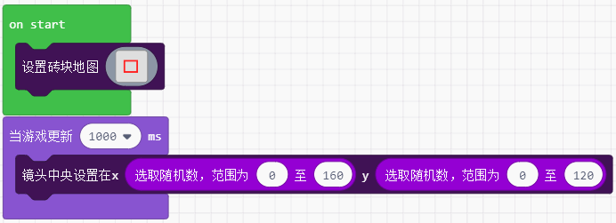

# 场景

## 屏幕  

得到并返回屏幕的像素宽和高 (喵比特是160x128)


```javascript
function screenWidth(): number;
```   

例子：  



---  

背景颜色的设置和获取  


```javascript
function setBackgroundColor(color: number); //设置背景颜色，颜色用0-15来表示
function backgroundColor() : number;  //获取颜色数值，未设置默认为0
```

例子：黑白背景切换实现闪屏  


--- 


  

```javascript
function setBackgroundImage(img: Image);  // img：作为设置背景的图片
function backgroundImage(): Image; //返回设置的背景图
```    

> [!NOTE|style:flat]
> 结合`图像`积木块，该分栏位于Advanced下。

例子：实现左右背景颜色每500ms交替  

   

---  

## 特效  
  
增加游戏体验，特效分别用于游戏中和游戏结束结果为win时  


    
  
例子：   
  
  

--- 

## 砖块  
  
游戏场景中包含砖块这个要素，它主要的功能在于奠定游戏的大场景，拥有物理特性。


 

```javascript  
function setTileMap(map: Image);  //map：通过颜色代号构建一个砖块场景，与屏幕中的像素比为1:16
function setTile(index: number, img: Image, wall?: boolean);  
//index:用于构建砖块的颜色代号，img：用于布置砖块的图案，collisions：(boolean)值为false时，精灵能够穿越砖块，为true时精灵将被砖块阻挡既生成物理碰撞
```   

例子：   

   

---  

下列两个积木块可结合使用，用于定位并替换砖块


   

```javascript  
//col、row:通过行和列来定位砖块  返回砖块在场景图中的位置，左上角为起始点0，0  
function getTile(col: number, row: number): tiles.Tile;  

//title:要替换的砖块对象， index：一个值用于替换之前的颜色代号
function setTileAt(tile: tiles.Tile, index: number);
```  

例子： 自上而下自左向右铺满红色砖块

   

---  

用于相同颜色索引的砖块批量替换

  

```javascript   
//index：一个颜色索引值  
//返回在砖块地图中具有相同颜色索引值的砖块数组  
function getTilesByType(index: number): tiles.Tile[];  
```  

例子：  

    

---  

可以将精灵准确的放置在砖块地图上的随机一个砖块位置上，通过颜色索引值去限制精灵所能匹配的砖块颜色类型  

   

```javascript  
//sprite：需要移动放置在砖块位置上的精灵， color：需要制定随机砖块的颜色索引
function placeOnRandomTile(sprite: Sprite, color: number): void;
```  

例子：设置一个有4中颜色索引的砖块地图，并且让绿色小精灵能够随机落在他们其中一个上    

     

---  

   

```javascript
//sprite：要移动到砖块上的精灵
place(mySprite: Sprite): void;
```
  
例子： 

  

---  

当精灵撞到指定的砖墙时，运行一些代码程序

   

```javascript
//kind：用于检测撞到墙的精灵类型，type：墙的类型(颜色索引)，handler：当有精灵碰到墙要执行的程序(sprite)：撞到墙的精灵
function onHitTile(kind: number, tile: number, handler: (sprite: Sprite) => void);
```

例子：当精灵碰到红色索引的墙，说一句 oh！

  
  

---  

两者都属于通过设置碰撞方位后，触发返回值类型的积木块，不同点在于：
- 前者返回为boolean
- 后者返回砖块索引值为数字


```javascript
isHittingTile(direction: CollisionDirection): boolean;  //返回值为boolean  
tileHitFrom(direction: CollisionDirection): number;     //返回值为砖块索引值 
//direction：发生碰撞时砖块位于精灵的方向：left, right, top, or bottom，
```

例子1：自由控制精灵移动，当撞到四面的墙分别说出对应的方位

  

例子2：设置两种索引值的砖块，当精灵分别碰到他们时说出对应的索引值

   

--- 

该积木块属于特效积木块，在遇到危险或发生碰撞事件时以震动来增强游戏体验

  

```javascript
//amplitude：震动的最大像素偏移量，duration：震动持续时间
function cameraShake(amplitude: number = 4, duration: number = 500);  
```

例子：同时设置精灵，背景和砖块，可以看出背景是不受震动影响的

  

---  

改变镜头的定位，不在使镜头一味停留在160x128的居中值。


  

```javascript 
function cameraFollowSprite(sprite: Sprite);  
//sprite：需要镜头跟随的精灵
function centerCameraAt(x: number, y: number);
//x,y：需要让镜头锁定的坐标数值
```

例子1：镜头跟随精灵移动，每当精灵撞到墙就翻转运动

  

例子2：画砖块地图的时候我们选择16x16像素的画布，实际得到的场景尺寸则为256x256，然后我们在中间画上一个方形砖块图，镜头每隔1s会随机锁定范围内的一个坐标

   

---  