# 精灵  

## 创建  

用于创建游戏中最基础的精灵(角色)

   

```javascript
//img：用于创建精灵的图像，kind：精灵的随意一个类型。返回一个包含图案的精灵
function create(img: Image, kind?: number): Sprite; 
```

## 物理  

设置精灵的基本物理属性：位置，速度

 
  

```javascript
//x,y：屏幕上精灵的新水平竖直的中心位置
//vx，vy：精灵的水平和竖直速度(像素/s)
setPosition(x: number, y: number): void;  
setVelocity(vx: number, vy: number): void;  
```

例子：

  

---  

如下三个积木块分别用于精灵属性的取值，改变值，设置值。

  

  

这个积木块包含下拉框许多可选属性，除了基本的x，y坐标，其他的属性依次为 

  

- vx、vy：xy轴速度
- ax、ay：xy轴加速度
- 生命值：(这里实际指的是生命周期)：既精灵能够存在的时间单位是s
- z(深度)：既一个前后关系，数值越大显示层级越前
- 宽度高度：精灵像素的大小
- 左、右、top、底部：表示精灵分别距离这四个方向的像素值(左上角为0,0)

例子：按下按键A让精灵位置到左上角，并且给一个横向速度vx=1pixel/s，按下B可以将原本为0的ax加1，反复按下效果等价于ax = ax + 1，同时精灵会一直说与左边界的距离

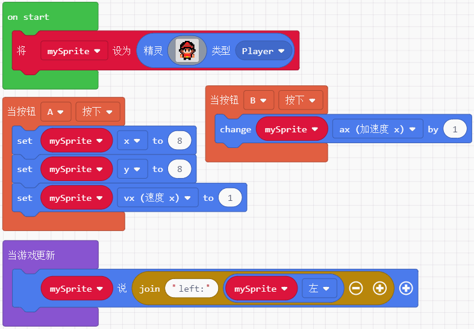 

---  

## 特效  

一下两个积木块用于给精灵添加特效和消除精灵特效

 
 

例子：按下A B键分别给精灵加特效和取消特效  

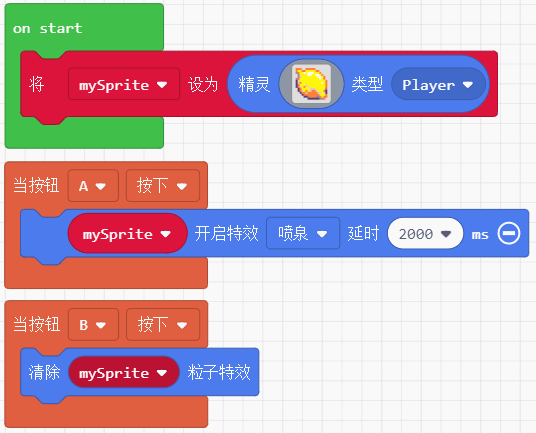 

---  

可以将精灵从游戏中消除，这样便无法使用该精灵的任何属性了。

  

```javascript
//effect:一个可选的内置特效
destroy(effect?: effects.ParticleEffect, duration?: number);
```

例子：可点+号增加销毁特效  

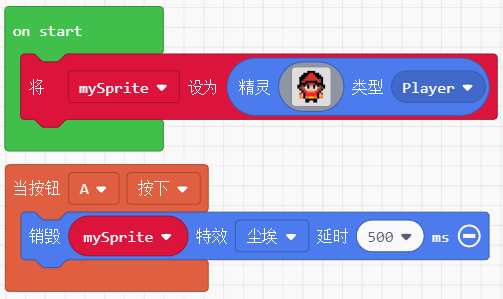    


---  

这是一个让精灵说话的积木块，会在精灵的头顶上生成一串字符串

     

```javascript
//text：值允许是字符串，timeOnScreen：说话框存在时间，textColor、textBoxColor：使用0-15的索引值分别表示字体颜色和说话框颜色。
say(text: string, timeOnScreen?: number, textColor = 15, textBoxColor = 1);
```

例子：说的4种支持方式

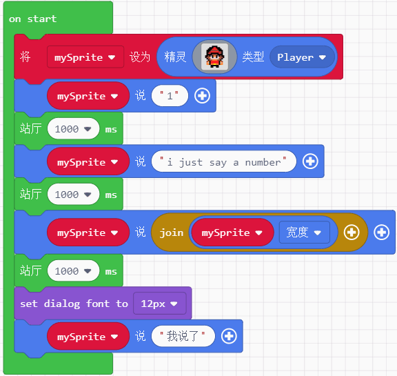  

---  

规定精灵的一些特性

 

```javascript
setFlag(flag: SpriteFlag, on: boolean);
```

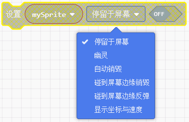

可选的选项分别表示：
- 停留于屏幕：让精灵只能处于160*128的屏幕内(可以配合镜头跟随积木块一起使用)
- 幽灵：编程幽灵的精灵无法发生物理碰撞和触发任何碰撞事件
- 自动销毁：变成幽灵的精灵走出屏幕范围后悔自动销毁
- 碰到屏幕边缘销毁：字面意思，当碰到地图边缘就会销毁
- 碰到屏幕边缘反弹：碰到屏幕边缘就反弹(既无法超出屏幕范围) 
- 显示坐标与速度：在精灵底部显示他的坐标和速度  

--- 

## 抛射物  


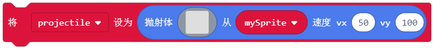  

```javascript
//img：用于创建精灵的图案，vx、vy：精灵在屏幕中的运动速度，sprite：一个精灵实例
function createProjectileFromSide(img: Image, sprite?: Sprite, vx: number, vy: number);  
function createProjectileFromSprite(img: Image, vx: number, vy: number);
```

例子：

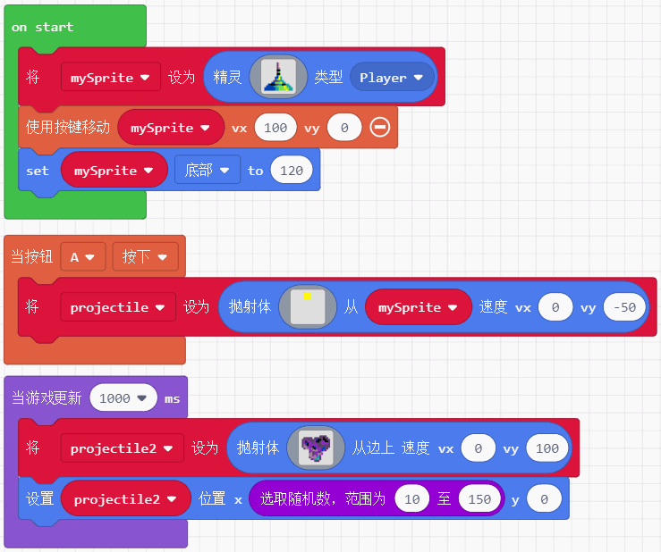  

--- 

## 重叠 

当规定的两种类型精灵相互重叠时，可以执行某些程序，前者触发后可以进入内部执行，后者常常跟逻辑语句结合使用，返回值是boolean

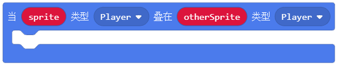  
  

```javascript
function onOverlap(kind: number, otherKind: number, handler: (sprite: Sprite, otherSprite: Sprite) => void);
function overlapsWith(sprite:Sprite)
```

例子： 

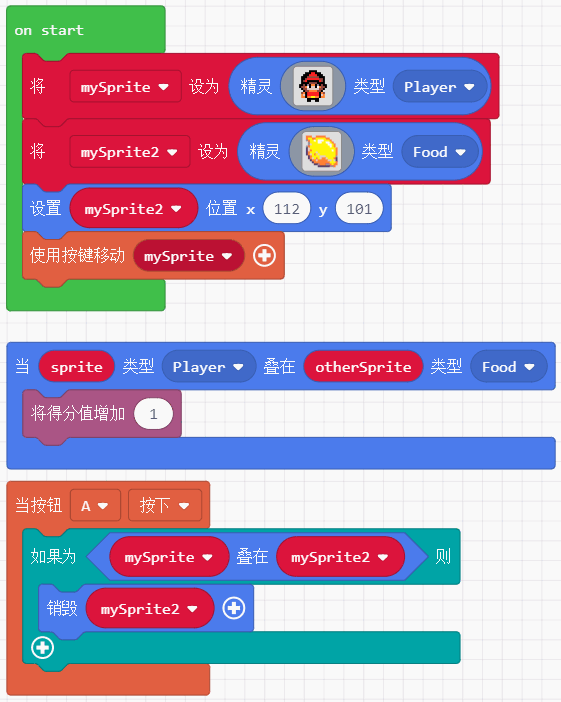 

---

以下两个积木块是关于精灵类型，可用于设置类型和返回类型


  

```javascript
setKind(value: number); //返回的是一个0开始的数值，具体掺照js代码顶部的SpriteKind顺序  
```

例子：如果不按A或B，当玩家碰到汉堡包，汉堡包被销毁。重置游戏，按下A，碰到汉堡包不会被销毁，接着按下B，汉堡包又能够被碰撞销毁

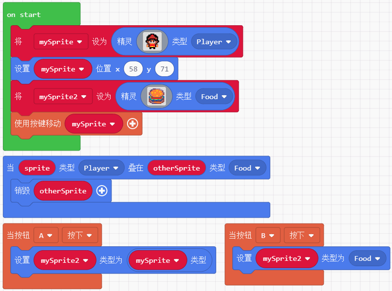  

--- 

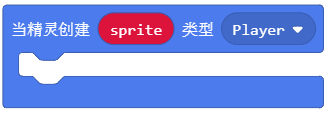
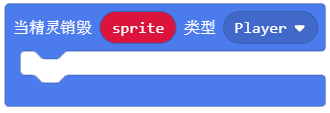 

```javascript
//kind: 要监视的创建/销毁精灵的类型，sprite：所有被创建/销毁的该种类精灵， handler：检测到有该类型精灵创建/销毁后能执行某些程序
function onCreated(kind: number, handler: (sprite: Sprite) => void)；
function onDestroyed(kind: number, handler: (sprite: Sprite) => void);
``` 

例子：让类型为food的汉堡精灵循环每隔一秒销毁或创建，当创建的时候让玩家精灵说看到食物了，销毁的时候则说食物不见了  

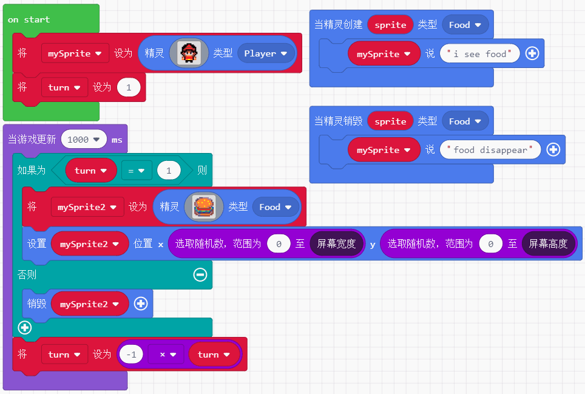   

--- 

为精灵设置一个新的图像，同时也可以将精灵的图像取出用于其他的精灵

 
  

```javascript
setImage(img: Image);  
```

例子：当玩家精灵碰到类型为Enemy的骷髅精灵时，骷髅被销毁，同时玩家精灵的图像被替换成骷髅 

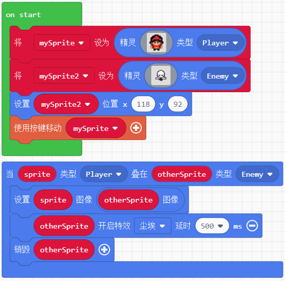 
