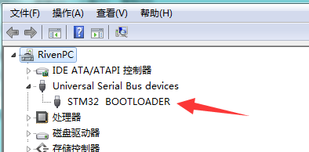
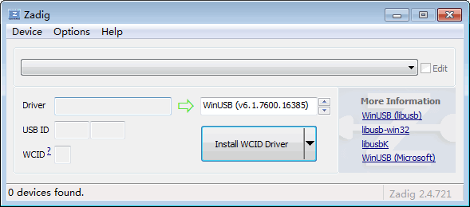
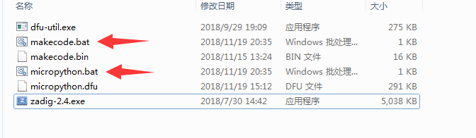

# 固件刷新教程

喵bit存在两种模式，分别是makecode和micropython，两种模式切换的时候需要刷入不同的固件。

## 下载升级软件

请先下载meobit的固件升级包，地址如下

[http://cdn.kittenbot.cn/meowbit/dfutil.zip](http://cdn.kittenbot.cn/meowbit/dfutil.zip)

将其解压到你的电脑上，等下我们会用到。

## 让喵bit进入dfu模式

请按住喵bit侧边的dfu按钮，之后插上usb电缆。成功进入dfu模式后应该可以在电脑设备管理器中看到一个新的设备

如果windows尝试从网络自动安装驱动，可以不用理会它或者中断。

## 替换dfu驱动程序

这时候我们打开升级包内的zadig程序

在options选择list all devices

之后在下拉框中找到STM32 BOOTLOADER，并选择Install Driver

驱动安装时间比较长请耐心等待。。。

## 更新对应的固件

在升级包下有两个bat脚本，分别对应Makecode和micropython的固件升级功能

只需要双击对应的bat脚本，之后会弹出一个升级框

之后按喵bit顶部的复位按钮就可以了~
