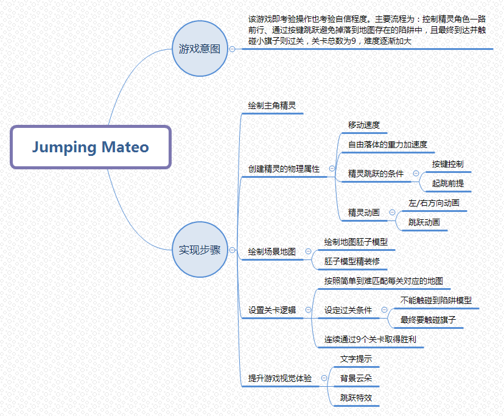
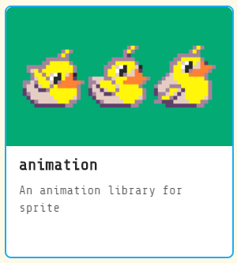
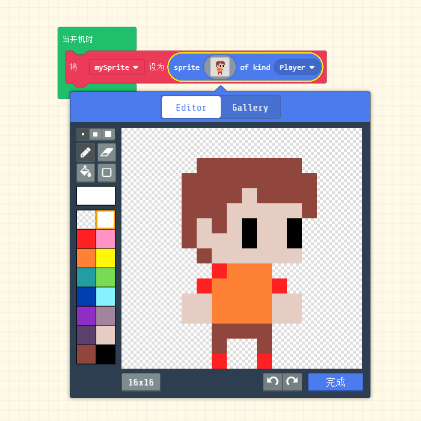
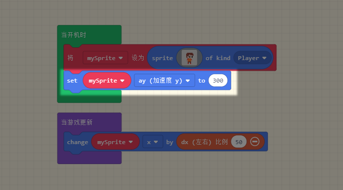

# 实战游戏1 - Jumping Mateo

by Adri314 in makecode forum

 

## 流程梳理  

  

首先我并不打算让大家先体验，为的是能够从半知半解中逐渐掌握并加以思考才更符合实战学习。  

## 实操步骤    
**准备工作**  

本次实战中的积木块可以根据颜色在对应颜色的分栏中找到，唯一需要额外添加的是【动画】这个插件，在扩展中可以找到  
 
 

1. **绘制精灵形象**   

 

2. **创建精灵物理属性 - 移动**   
【当游戏更新】积木块是常用积木块，它的功能就等同于一般的无限循环，于是此处我们的意图就是让以50px/s的速度只允许x轴移动精灵  
  

3. **创建精灵物理属性 - 重力加速度**   
重力加速度作用在y轴用ay表示，设定数值为300(300px/s2)  
此时可以看到模拟器的小人一开始就‘嗖’一下掉下去了    
  

4. **创建精灵物理属性 - 跳跃**  
在明白跳跃的原理前我们必须知道2个物理公式： 

v2 - v02 = 2ax 
  

v = v0 + at 
 

他们分别属于知道3个条件中的2个求得剩下的一个。之前我们已经设定了重力加速度为300  

!> 屏幕左上角为坐标(0,0) 

于是我们一直了a = 300，

