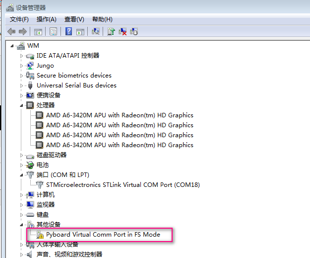
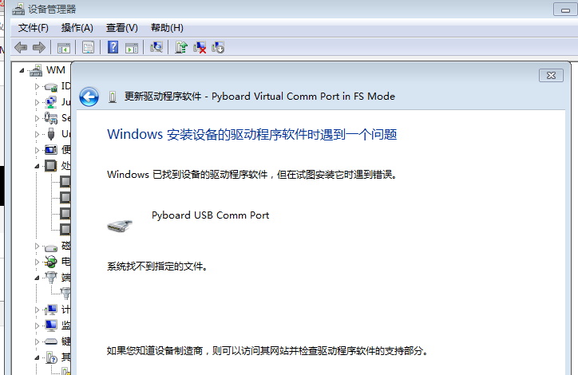
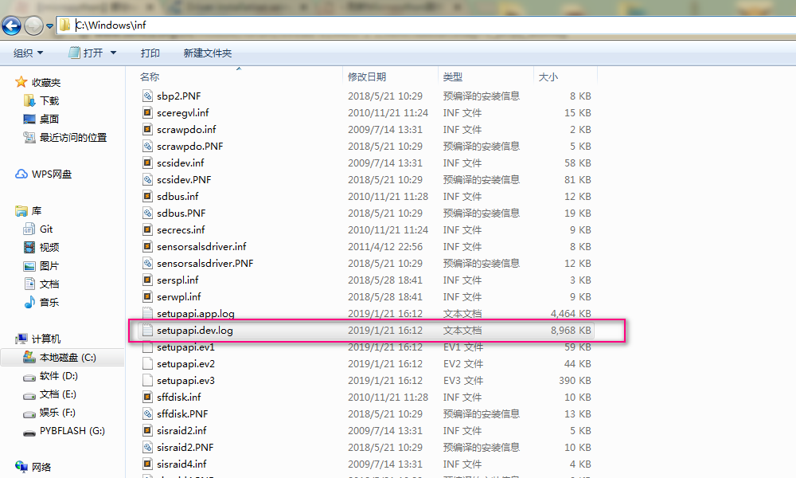
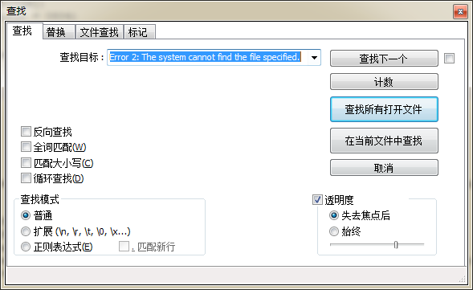
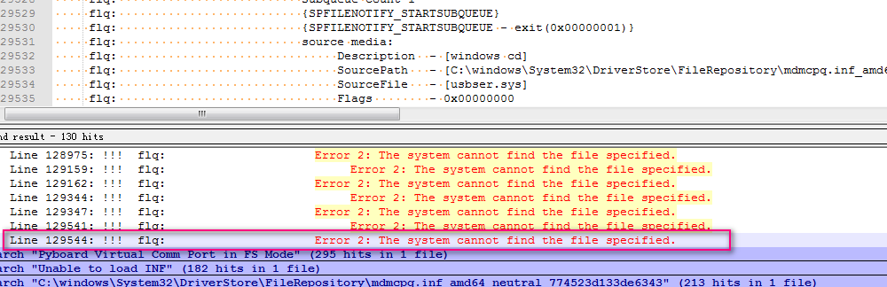
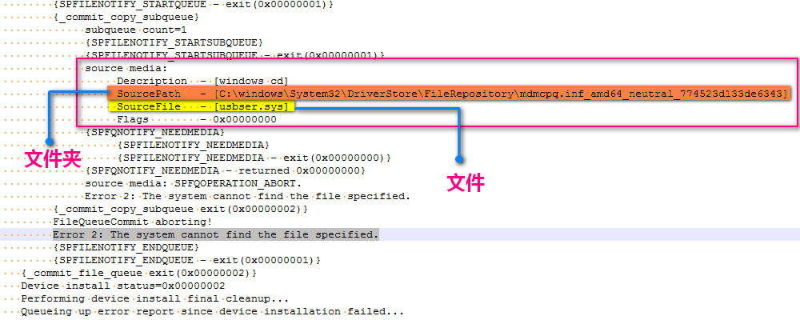
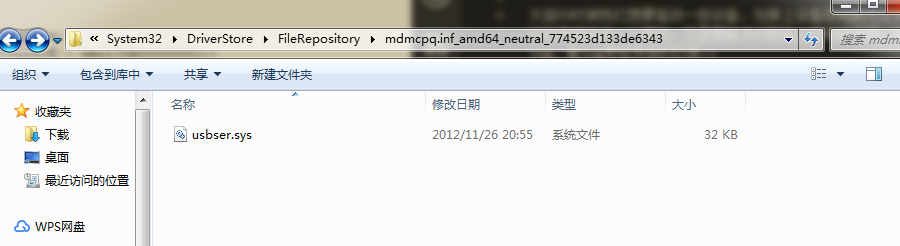
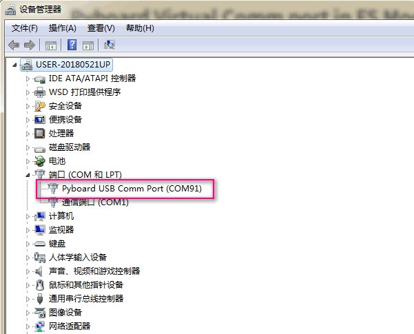

# Pyboard Virtual Comm Port驱动安装失败

  

  
出现这种情况原因应该就是ghost系统缺少某些文件

要解决这个问题需要我们手动去下载缺失的文件

## 查看驱动安装日志文件

大部分时候我们想要驱动一些设备，当接上设备后电脑无论如何都无法安装驱动却不会直观告诉你为什么，这就会对我们的使用造成一个困扰。凡是要解决问题就必须知道原因，所以第一步就是通过查看驱动安装日志来寻找问题(俗称log，看log是程序猿的日常~)
每一次驱动安装都会在日志中有记录(无论是成功还是失败)

- **日志文件所在位置**

C:\Windows\inf\setupapi.dev.log  

- **使用编辑器打开**

使用编辑器打开，这里推荐使用Notepad++或VSCode，主要好处就是界面明朗，格式清晰。  

- **搜索**

搜索快捷键Ctrl+F  

搜索内容：Error 2: The system cannot find the file specified.  并点击在当前文件中查找

进度条拉到最底下，并双击这条信息  
  

就可以跳至问题行，往上看一点，可以看到一个文件夹地址和一个文件名  
  

首先确认对应位置是否存在上述文件夹，若存在则在网上搜索SourceFile后面的文件名字并下载放入这个文件夹内(一般缺的就是 usbser.sys 文件)

[这里提供直接下载](https://bbs.kittenbot.cn/forum.php?mod=viewthread&tid=465&extra=)

若搜索不存在上述文件夹，则手动新建一个并将文件下载并复制到这里

重新拔插USB按下复位键应该就可以自动成功安装了

