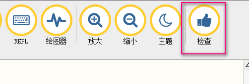
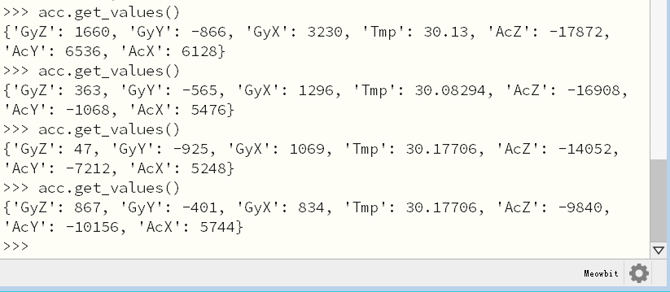

# micropython编程和使用

## 彩屏显示

?>喵比特上装有一块160x128像素的1.8寸全彩液晶屏。这绝对是比Microbit更有优势的一点

**Framebuffer介绍**

说到显示设备我们不得不说下Framebuffer，framebuffer是电脑中用来缓存显示屏上面数据的内存区域，其中的数据对应屏幕上每个点的颜色值。大家后面如果有机会接触树莓派linux或者其它操作系统的驱动层代码，也会发现有这样一个framebuffer定义，有的甚至有好几个备份保证刷新频率。

我们首先来做一道数学题，我们喵bit液晶屏像素是160x128像素，一共就是160x128=20480个像素，如果每个像素两个字节就是20480x2=40960个字节，也就是需要40k（1k是1024个字节）的内存区域存储屏幕图形。而喵bit内部一共的内存大小只有96k，差不多一半的内存来存放图形数据了。

那么microPython下的framebuffer也是这样一块内存区域。不同的是我们要先分配好内存区域，下面我们show代码：

```python
	# 导入需要的库
	import pyb
	import framebuf

	# 分配内存区域
	fb = framebuf.FrameBuffer(bytearray(160*128*2), 160, 128, framebuf.RGB565)  
	# class framebuf.FrameBuffer(缓冲内存空间, 屏宽, 屏高, 格式) 
``` 

`bytearray`函数是分配一段字节空间。

`FrameBuffer`函数就是以刚刚分配的空间为存储构造一个Framebuffer对象fb

---
**液晶屏刷新显示Framebuffer**

接下来我们需要启用喵比特的液晶屏对象，代码如下：
```python
	tft = pyb.SCREEN()
```
并且让屏幕填满蓝色，之后刷新显示
```python
	fb.fill(0x0000FF)
	tft.show(fb)
```  
?>在显示具体内容实际只有2个步骤和2个前提：
- 前提1：初始化帧缓冲对象fb  
- 前提2：启用液晶屏对象
- 步骤1：给帧缓冲区加要显示的内容
- 步骤2：通过show()方法显示出来

为什么这么麻烦呢？这是为了最大化编程的灵活性，实际操作中这种对象化的思想在python中无处不在。

```python
	fb.fill(0)
	fb.text('MicroPython!', 0, 0, 0xffffff) 
	 #fb.text(显示内容，X坐标，Y坐标，颜色)  
	fb.hline(0, 10, 96, 0xffffff)

	tft.show(fb)
```	
具体可以参考Micropython官方的[Framebuffer文档](https://docs.micropython.org/en/latest/library/framebuf.html)

!>官方的FrameBuffer使用的是565颜色定义，而我们修改了FrameBuffer的部分代码直接使用RGB的十六进制显示，这样省去换算的功夫对用户更加友好。  

---  
**制作启动画面**

?>1.使用mu加载u盘上的main.py文件，整合下我们这节的代码：
```python
	import pyb
	import framebuf

	tft = pyb.SCREEN()
	fbuf = bytearray(160*128*2)
	fb = framebuf.FrameBuffer(fbuf, 160, 128, framebuf.RGB565)

	fb.fill(0)
	fb.text('Welcome to meowbit', 4, 50, 0xffffff) 

	tft.show(fb)
```
?>2.保存main.py


?>3.复位喵比特。看看是不是启动就出现了欢迎界面呢？  
  
!>一开机的欢迎界面，根据显示需要的字节空间，如此就耗掉了板子的40%内存


## 可编程led
  


喵bit的右上角有两颗可编程的led，从左数分别绿灯LED(1),和红灯LED（2）。控制LED虽说作为硬件入门是最基本的一个项目，但其在任何一个大型项目的实际交互过程中的地位都是及其重要的（想想，LED不同颜色，不同的闪烁频率所代表的含义已经深入日常生活呢）

**控制LED的方法**
    
    on()      # 点亮
    off()     # 熄灭 
    toggle()  # 切换

除了on()和off()能够分别控制LED亮灭外，LED对象还提供了一个toggle()方法  
用处是在现有的状态上取反。也就是说若目前LED(1)状态为on()，则执行toggle()后，LED(1)显示为off()状态

---
**例1：DISCO效果**

使用toggle()方法来控制板载的两颗LED灯实现一个炫酷的disco效果

```python
from pyb import LED 
import time

leds = [LED(i) for i in range(1, 3)]   
# for i in range(1,3)意指i=1，i=2。如此leds = [LED(1),LED(2)]

# 由于toggle()需要知道现在的状态从而切换，所以在程序开始时需要将全部LED状态先置为off()
for l in leds: 
	l.off()
	
n = 0
while True:
	n = (n + 1) % 3   # 让n在0,1,2中切换
	if n == 3:        # 由于LED只有1,2两颗，所以为了方便理解，我们排除3(不排除其实也没有问题)
		n == 1   
	leds[n].toggle()    
	time.sleep(0.05)  # 延时0.05s
	n += n 
```  

!>想知道自己写的程序是否有错误，推荐使用Mu提供检查功能

  
  

## 按键检测  

喵bit上还有6个可编程的按键，如果使用过喵bit的makecode平台的同学可能会发现完全就是个可编程的游戏机。那么在micropython下是不是也能实现同样的功能呢？    

无奈小喵家人力资源有限，完整的micropython游戏引擎正在制作todo列表上逐步推进，这里就先用按键做一些简单的东西。

?>按键可以分为`直接读取按键值`和`按下事件`触发两种使用方式。

**直接读取按键值**

喵bit的按键都是按下导通地，也就是当按下后按键对应的io读取值为0。打开mu后通过终端连上喵比特，这节内容比较简单我们直接在`终端`上写代码就行了。  

?>先试一下不按按键A时输入button.value()，再试试按下A回车执行，观察返回值     

```python
	from pyb import Pin
	button = Pin('BTNA', Pin.IN, Pin.PULL_UP)  
	# Pin(IO的名称, 读写方式，上拉/下拉)  
	button.value()
```  

!> Pin是IO配置函数，其中IO的名称6个按键分别对应UP,DOWN,LEFT,RIGHT,BTNA,BTNB


---
**按键事件**

使用按键事件就是当按键按下后去执行某个函数，这时候我们需要micropython另外一个库ExtInt(外部中断库).

?>1.在中断逐行敲下下面代码  
```python
	from pyb import Pin, ExtInt
	
	def callback(line):
	    print("pressed =", line)

	extint = ExtInt('BTNA', ExtInt.IRQ_FALLING, Pin.PULL_UP, callback)
```  
  
?>2.试着按A键，可以看到中断返回的数字，既是当前按键的中断源  
  
<!-- ?>3.下面结合显示，将每个按键的中断源一口气测得。拷贝如下程序到main.py并保存  
   -->

其中中断回调函数callback的参数line是中断源，每个按键的中断源都不一样。

## 陀螺仪  

喵bit上还板载了在创客项目中非常常见的6轴陀螺仪和加速度计mpu6050，理论上我们甚至可以diy一个平衡小车或无人机。

**导入陀螺仪6050库**

跟使用spi-flash一样，mpu6050库并没有放在固件中(内存宝贵)，我们需要外部导入。在喵bit的u盘根目录下建立mpu6050.py文件并复制下面的驱动代码到里面。

```python
	class accel():
	    def __init__(self, i2c, addr=0x68):
	        self.iic = i2c
	        self.addr = addr
	        self.iic.init()
	        self.iic.send(bytearray([107, 0]), self.addr)
	
	    def get_raw_values(self):
	        a = self.iic.mem_read(14, self.addr, 0x3B)
	        return a
	
	    def get_ints(self):
	        b = self.get_raw_values()
	        c = []
	        for i in b:
	            c.append(i)
	        return c
	
	    def bytes_toint(self, firstbyte, secondbyte):
	        if not firstbyte & 0x80:
	            return firstbyte << 8 | secondbyte
	        return - (((firstbyte ^ 255) << 8) | (secondbyte ^ 255) + 1)
	    
		def get_ac_x(self):                  # 单独读取x轴加速度值
			raw_ints = self.get_raw_values() 
			ac_x = 0
			ac_x = self.bytes_toint(raw_ints[0], raw_ints[1])
			return ac_x
    
		def get_ac_y(self):
			raw_ints = self.get_raw_values() 
			ac_y = 0
			ac_y = self.bytes_toint(raw_ints[2], raw_ints[3])
			return ac_y
			
		def get_ac_z(self):
			raw_ints = self.get_raw_values() 
			ac_z = 0
			ac_z = self.bytes_toint(raw_ints[4], raw_ints[5])
			return ac_z
		
		def get_g_x(self):						# 单独读取重力加速度值
			raw_ints = self.get_raw_values() 
			g_x = 0
			g_x = self.bytes_toint(raw_ints[8], raw_ints[9])
			return g_x
			
		def get_g_y(self):
			raw_ints = self.get_raw_values() 
			g_y = 0
			g_y = self.bytes_toint(raw_ints[10], raw_ints[11])
			return g_y
			
		def get_g_z(self):
			raw_ints = self.get_raw_values() 
			g_z = 0
			g_z = self.bytes_toint(raw_ints[12], raw_ints[13])
			return g_z

	    def get_values(self):					# 同时读取
	        raw_ints = self.get_raw_values()
	        vals = {}
	        vals["AcX"] = self.bytes_toint(raw_ints[0], raw_ints[1])
	        vals["AcY"] = self.bytes_toint(raw_ints[2], raw_ints[3])
	        vals["AcZ"] = self.bytes_toint(raw_ints[4], raw_ints[5])
	        vals["Tmp"] = self.bytes_toint(raw_ints[6], raw_ints[7]) / 340.00 + 36.53
	        vals["GyX"] = self.bytes_toint(raw_ints[8], raw_ints[9])
	        vals["GyY"] = self.bytes_toint(raw_ints[10], raw_ints[11])
	        vals["GyZ"] = self.bytes_toint(raw_ints[12], raw_ints[13])
	        return vals  # returned in range of Int16
	        # -32768 to 32767
	
		# 同时读取持续打印数据用于测试
	    def val_test(self):  # ONLY FOR TESTING! Also, fast reading sometimes crashes IIC
	        from time import sleep
	        while 1:
	            print(self.get_values())
	            sleep(0.2)
```

**读取陀螺仪数据**

回到mu的终端repl，我们首先要导入mpu6050的库。由于陀螺仪芯片是使用i2c接口和主芯片进行通信，我们还需导入i2c的对象。

```python
	import mpu6050
	from pyb import I2C, Pin
	
	i2c = I2C(1)
	acc = mpu6050.accel(i2c)
	acc.get_values()
```

最后一行就是读取陀螺仪的数据，大家可以在终端中多执行几次`acc.get_values()`这个命令。

MPU6050 测试 main.py

```python
    import mpu6050
    from pyb import I2C, Pin

    i2c = I2C(1)
    acc = mpu6050.accel(i2c)
    acc.val_test()
```




## 蜂鸣器  

蜂鸣器的原理是发送某个频率的脉冲刺激压电陶瓷的震动而发出声音，那我们要做的就是如何让主控芯片发送指定频率的脉冲了。

**初始化pwm硬件**

首先我们需要硬件的定时器来产生指定频率的pwm信号，喵bit的蜂鸣器接在PB8引脚上,而PB8对应定时器4通道3输出。

```python
	from pyb import Pin, Timer
	buzz = Pin("BUZZ")
	tim = Timer(4, freq=3000)
	ch = tim.channel(3, Timer.PWM, pin=buzz)
```

上面我们生存了两个对象，其中tim是我们的定时器。它在芯片内部是一个计数器，当计数值达到阈值的时候可以通过编程触发不同的行为，而让引脚电平改变就是其中一种。ch是我们的定时器输出对象，它将定时器的输出指向外部io引脚。因此定时器对象可以控制输出的频率，而通道对象可以控制输出波形的模式。

**输出音符Do**

我们知道C4调的音符Do的频率是262Hz，那么我们可以配置tim和ch对象输出对应的频率。

```python
	tim.freq(262)
	ch.pulse_width_percent(30)
	pyb.delay(1000)
	ch.pulse_width_percent(0)
```

上面代码我们首先设置定时器的频率，之后使能定时器输出通道。之后延时1秒钟，也就是一拍，再关闭通道的输出。

## 光线/温度传感器   

喵bit上还有一颗光线传感器和温度传感器，可以用于检测环境光强和温度。这两个传感器都基于读取外部模拟值电平实现。

**读取光线和温度传感器ADC值**

我们首先先初始化ADC对象，之后调用read函数返回电压值。注意喵bit的adc是12位的，也就是adc原始值范围是0~4095。

	from pyb import ADC, Pin

	adc = ADC(Pin('LIGHT'))
	adc.read()

同样道理将LIGHT换成TEMP引脚，大家可以将下面代码敲到repl中，看看温度传感器的原始值

	from pyb import ADC, Pin

	adc = ADC(Pin('TEMP'))
	adc.read()

返回值如下：

	>>> adc.read()
	2199

但是怎么和温度关联起来呢？


**温度传感器**

喵bit上面的温度传感器实际上是一颗热敏电阻，它随着温度变化会改变自身的电阻值大小，进而分的电压也不同。具体还需要涉及选型和温度曲线的标定等等知识，这里就不再详述了，代码里面都有。大家直接在根目录下创建一个thm.py文件，将项目的驱动代码复制到里面就行了：

	import math
	def adc2temp(adcValue, res=10000, beta=3300, norm=25.0, normread=10000, zero=273.5):
	    sensor = 4096.0*res/adcValue - res
	    value = (1.0 / ((math.log(sensor / normread) / beta) + (1.0 / (norm + zero)))) - zero
	    return value


记得重启喵bit，之后重新打开终端：

我们使用刚刚的adc2temp函数对adc原始值做映射：

	>>> import thm
	>>> thm.adc2temp(adc.read())
	29.83557

**注意：我们读的实际上板子上的温度，由于板子有各种原件和液晶屏的背光在发热，实际上比环境温度要高几度。**

