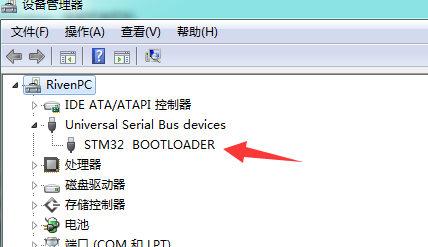
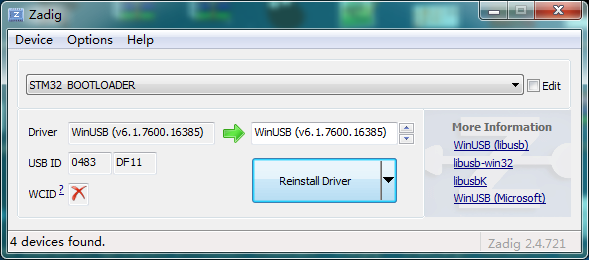
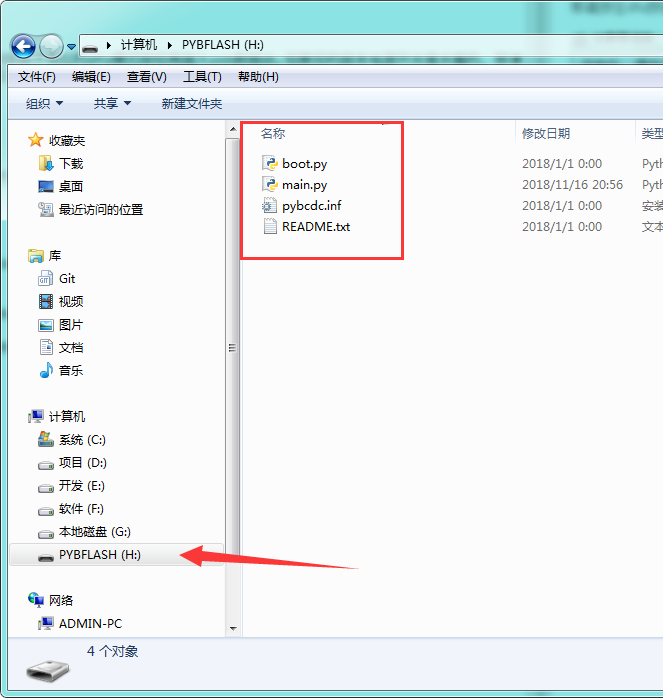
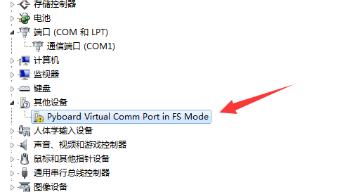
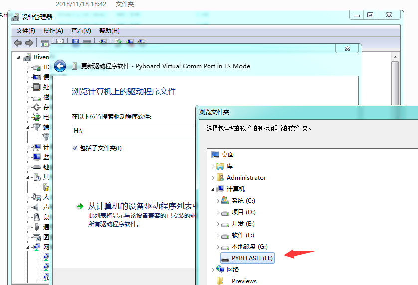
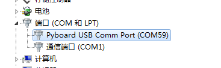

# 刷新Micropython固件

由于meowbit支持两种不同学习模式，分别是微软的Makecode平台和Micropython模式。因此在切换学习模式的时候需要重新刷入新的固件。

**注意：小喵家的kittenblock的meowbit支持也是基于Micropython的哦。**

## 手动刷新固件

刷新固件首先需要让Meowbit进入dfu模式，方法很简单，就是按住板子侧边的dfu模式按钮再插入usb数据线。如果您的版本电源开关是关着的，那请按住dfu按钮再打开开关。成功进入dfu模式后可以看到系统中出现一个新的STM32的BootLoader设备

进入dfu模式后就可以松开dfu按钮了。

这时候我们需要安装dfu的libusb驱动程序，请前往小喵家的官方下载Zadig过滤驱动替换程序。在Options下拉选择listall，找到STM32 BootLoader并且选择Install Driver

之后在mueditor的安装目录下面有一个firmware目录，双击updater.bat脚本文件进行刷入micropython的固件，静静地等待脚本自动完成就好了。

**注意：刷新过程中请不要动usb电缆，万一中断需要重新按住dfu按钮重新上电进入dfu模式。**

刷新成功后请按喵bit顶部的复位按钮（或者拔掉喵bit的usb线并重新插上），如果一切正常大家可以看到电脑多了一个名为pybflash的u盘盘符。

## 安装串口驱动程序

如上大家可以看到喵bit虚拟u盘内有四个文件，其中：

- boot.py 是启动文件，一上电micropython会最优先执行这个文件，一般包括所有运行环境和库文件的初始化。
- main.py 是用户的主程序，大家平时学习开发主要是编辑这个文件，喵bit准备就绪后会自动执行这个文件的代码。
- pybcdc.inf 是串口驱动程序，也是我们这一节需要的文件。
- README.txt 是micropython官方的说明文档

大家在设备管理器中应该可以看到如下一个没有驱动的硬件设备

右键点击这个设备，并选择安装设备驱动，之后选择手动安装驱动，并将搜索目录指向喵bit的u盘盘符。

驱动安装成功后大家可以看到电脑多出来一个新的串口设备

在后续的教程中我们会详细讲解这个串口的用途。