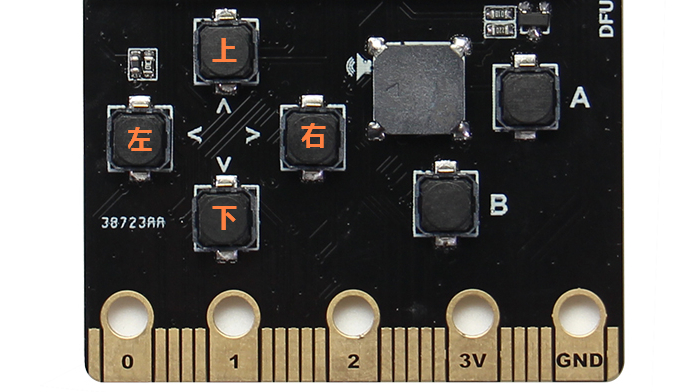

# 可编程按键

喵bit上还有6个可编程的按键，如果使用过喵bit的makecode平台的同学可能会发现完全就是个可编程的游戏机。那么在micropython下是不是也能实现同样的功能呢？无奈小喵家人力资源有限，完整的micropython游戏引擎暂时还只在todo list上排队，但是使用按键编写一些简单的东西还是可以的。

按键可以分为直接读取按键值和按下事件触发两种使用方式。

## 直接读取按键值

喵bit的按键都是按下导通地，也就是当按下后按键对应的io读取值为0。打开mu后通过终端连上喵bit，这节内容比较简单我们直接在终端上写代码就行了。

	from pyb import Pin
	button = Pin('BTNA', Pin.IN, Pin.PULL_UP)
	button.value()

其中Pin是IO配置函数，第一个参数是IO的名称。6个按键分别对应`UP, DOWN, LEFT, RIGHT, BTNA, BTNB`

## 按键事件

使用按键事件就是当按键按下后去执行某个函数，这时候我们需要micropython另外一个库ExtInt.
	
	from pyb import Pin, ExtInt
	
	def callback(line):
	    print("pressed =", line)

	extint = ExtInt('BTNA', ExtInt.IRQ_FALLING, Pin.PULL_UP, callback)

其中中断回调函数callback的参数line是中断源，每个按键的中断源都不一样。

