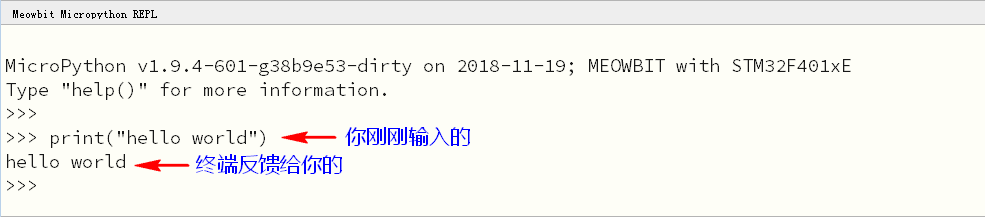

# 快速开始

?> 我们已经知道喵bit的u盘下有一个main.py文件，我们现在就要直接编辑这个文件，做出我们第一个程序。

!>如果您之前刷新过Makecode固件，有一定几率可能或导致喵bit上电后假死，这时会看到u盘下main.py或boot.py内容为乱码。请务必将u盘下的所有文件删除，之后重启板子micropython会重新生成这四个文件。
使用mac的同学可以去我们的网站或者固件发布帖下载对应的执行脚本，在命令行终端下执行对应的更新指令就行了。Ubuntu或linux的同学默认你们知道openocd和dfu-util，看看windows或者mac的脚本应该就行了。
## mu-editor连接上喵bit

1. 首先我们打开mu-editor，之后将喵bit连接上电脑。
2. 在mu-editor左上角的硬件框总选择meowbit，如果您安装了串口驱动也会发现mu-editor自动提示您找到喵bit并为您自动切换。


mu顶部有个REPL按钮，REPL全称是(Read Eval Print Loop:交互式解释器)。常见的脚本语言例如js和python都有这样的一个快速编程执行的终端界面，后面我们简称**终端**就好了

找到喵bit后我们就使用mu连接上它的终端，在mu顶端选择repl按钮，并在下方会出现喵bit的通信终端。3. 找到喵bit后我们就使用mu连接上它的终端，在mu顶端选择repl按钮，并在下方会出现喵bit的通信终端。


我们在终端输入如下代码并键盘按下回车，可以看到终端中主板也回应了一个Hello world回来。

```python
	print("hello world")
```



!>因为喵bit的串口是软件模拟出来的，如果连接失败请照着mu的提示复位喵bit并等待3s左右再重新连接。


## 与Meowbit的第一次交互

通常来说，与硬件的首次交互大都以点亮led的形式，好比软件入门的第一个helloworld程序。我们先在终端一行行敲下并回车如下代码  

>	import time  
	from pyb import LED  
	led = LED(1)  
	led.on()  
	led.off()  

可以看到屏幕右上角的第一颗LED当输入完“led.on()”就亮了，当输入完“led.off()”就灭了

## 尝试脱离电脑

REPL只是一个用于调试的交互环境，要真正掌控一款硬件最重要的就是自动化，那么将程序下载到硬件中便是这么一个目的。

在mu的顶部工具栏选择加载喵bit上的main.py文件。（注意咯：程序执行入口一定是main.py）


在编辑器界面修改代码为如下并保存

```python
	import time   # 需要用到延时，所以导入time模块
	from pyb import LED

	led = LED(1)

	while True:     # 需要开机后led持续亮灭循环
		led.on()
		time.sleep(1)  # 延时1s
		led.off()
		time.sleep(1)
```

?> 点了保存后，程序就会被下载进板子里，下载中右上角的绿灯会亮起，这个过程中一定不要按复位，需要等待右上角绿灯熄灭`


!> 记住一定要保存，不然不生效。保存成功过后，需要按下侧面的复位键(这点是必须的)，就可以看到写的程序执行了，绿灯隔一秒亮灭一次

## REPL使用小窍门

- micropython的repl有自动补全功能， 若果你想知道pyb对象中到底有哪些方法和变量，那么你只需要敲如`pyb.`并按下Tab键，或者`pyb.L`按下Tab键，就可以补全为pyb.LED。平时在编程中推荐大家多用自动补全的功能，防止因为拼写错误导致程序崩了那就很尴尬了

- repl另外一个功能就是按键盘方向键↑可以快速调出之前执行过的命令，这样一些重复执行的命令就不需要再敲一遍了  

## 如何恢复通过REPL控制喵比特

只需要将u盘上的main.py里面的代码清空后保存


再复位主板就可以重新正常使用终端了~

`终端控制的好处就是程序控制所见即所得`，不用按复位按键什么的

