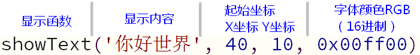
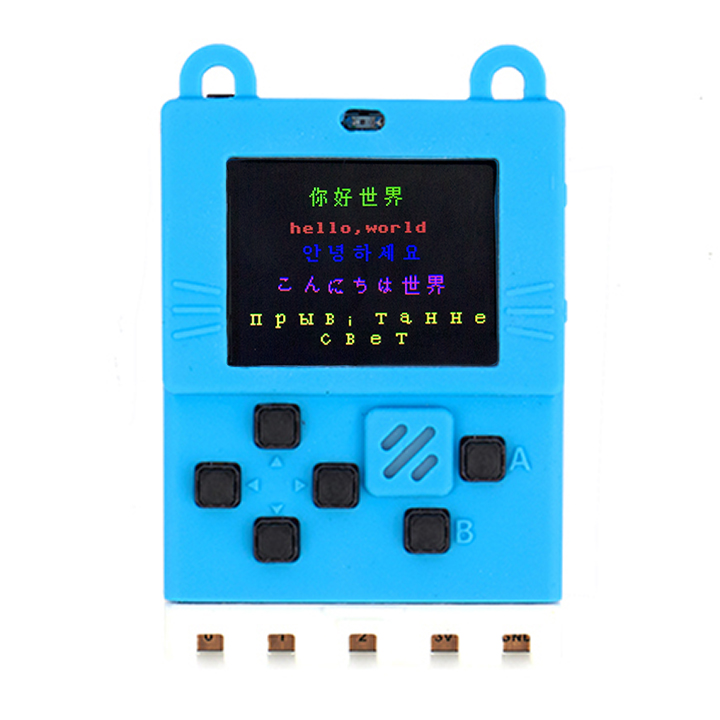

# 液晶屏显示多国语言字符

通过[液晶屏显示与编程](micropython/液晶屏显示与编程)我们学习了如何使用液晶屏和framebuf这个库，我们可以使用`fb.text`这个函数显示字符串。  

!> fb.text显示的功能相当局限，只能显示ascII字符（一般的英文字母数字还有常见的标点符号)

那么如果要显示中文或其他语言的字符就需要额外的字符编码表了。

所谓字符编码表就是保存了各种字符串和液晶屏需要显示点阵内容的映射，如果一个字符需要16x16个像素也就是32个字节，那么中国5000个汉字就需要160k的储存空间了（也就是喵bit的硬盘空间，注意和内存空间区分），何况还有其他各种语言的各种字符。很明显将这些字符串码表保存在代码中相当不现实，这时候我们就需要借助外部存储了。

在喵bit上有一颗2M的spi-flash，我们出厂烧录了12x12像素unicode码表，这里面基本涵盖了这个星球上所有的语言。插在电脑上会显示一个2M的U盘。如果没有字库的可以点击这里下载，拷贝到Micropython的U盘上就行了~

[http://cdn.kittenbot.cn/meowbit/unicode12.bin](http://cdn.kittenbot.cn/meowbit/unicode12.bin)

**makecode下多语言显示也是使用同样的字库**

字库文件占用大概1.5M，还剩下500k左右空间放各种代码

注意V2更新后，只要把液晶屏字库拖入U盘就行了。 不再需要spi-flash驱动库，内部已经将spi-flash变成一个u盘了

	
## 编写字符串显示程序

在我们的main.py文件，我们先初始化framebuffer，并且导入我们刚刚保存的spiflash库，注意import导入不需要文件后缀

	import pyb
	import framebuf
    import time
	
	fbuf = bytearray(160*128*2)
	fb = framebuf.FrameBuffer(fbuf, 160, 128, framebuf.RGB565)
	tft = pyb.SCREEN()
	fb.fill(0)
	time.sleep(1)
	# 打开unicode12.bin文件，以二进制只读模式
	time.sleep(1)
	f = open('unicode12.bin', 'rb')

之后我们定义一个字符串显示的函数，它的任务就是在字库文件`unicode12.bin`中找到对应字符的点阵数据并渲染到framebuffer上的指定像素位置。
	
	def showText(txt, x, y, col):
	    for c in txt:
	        f.seek(ord(c)*24)
	        b = f.read(32)
	        y0 = y
	        for i in range(0,24,2):
	            for j in range(7, -1, -1):
	                if (b[i]>>j) & 0x1:
	                    fb.pixel(x+7-j, y0, col)
	                else:
	                    fb.pixel(x+7-j, y0, 0x0)
	            for j in range(7, -1, -1):
	                if (b[i+1]>>j) & 0x1:
	                    fb.pixel(x+8+7-j, y0, col)
	                else:
	                    fb.pixel(x+8+7-j, y0, 0x0)
	            y0+=1
	        x+=16
	    time.sleep(0.1)
    

> 最后time.sleep(0.1)是文件系统速度保护，如果文件系统过快的操作会导致假死现象~

最后激动人心的时刻到了，我们来显示多国语言的helloworld~

    showText('你好世界', 40, 10, 0x00ff00)
    fb.text('hello,world', 32, 35, 0xff0000)
    showText('안녕하세요', 35, 50, 0x0000ff)
    showText('こんにちは世界', 24, 70, 0xf000f0)
	
	tft.show(fb)
    f.close()

最后保存main.py文件并复位喵bit。

PS1：当然也可以直接使用`showText('Hello world', 32, 30, 0xff0000)`直接显示英文

PS2：有能力的同学也可以diy自己的字符库甚至图片并保存到u盘中，当然也需要修改对应的show方法。

## 注意事项

当在喵bit的u盘下建立新的文件后，必须要重启喵bit，当前的运行环境是不知道有新的库文件进来的。

如果您发现代码保存并复位喵bit没效果，可能是代码中有错误。这时候可用使用mu的代码检查功能，或者打开mu的终端工具，如果代码有异常启动后会将错误反馈到终端上。

## 完整的main.py代码如下

	# main.py -- put your code here!
	import pyb
	import framebuf
	import time
	
	fbuf = bytearray(160*128*2)
	fb = framebuf.FrameBuffer(fbuf, 160, 128, framebuf.RGB565)
	tft = pyb.SCREEN()
	fb.fill(0)
	f = open('unicode12.bin', 'rb')
	def showText(txt, x, y, col):
	    for c in txt:
	        f.seek(ord(c)*24)
	        b = f.read(32)
	        y0 = y
	        for i in range(0,24,2):
	            for j in range(7, -1, -1):
	                if (b[i]>>j) & 0x1:
	                    fb.pixel(x+7-j, y0, col)
	                else:
	                    fb.pixel(x+7-j, y0, 0x0)
	            for j in range(7, -1, -1):
	                if (b[i+1]>>j) & 0x1:
	                    fb.pixel(x+8+7-j, y0, col)
	                else:
	                    fb.pixel(x+8+7-j, y0, 0x0)
	            y0+=1
	        x+=16
	    time.sleep(0.1)
	
	showText('你好世界', 40, 10, 0x00ff00)
	fb.text('hello,world', 32, 35, 0xff0000)
	showText('안녕하세요', 35, 50, 0x0000ff)
	showText('こんにちは世界', 24, 70, 0xf000f0)
	
	tft.show(fb)
	f.close()