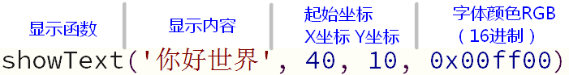
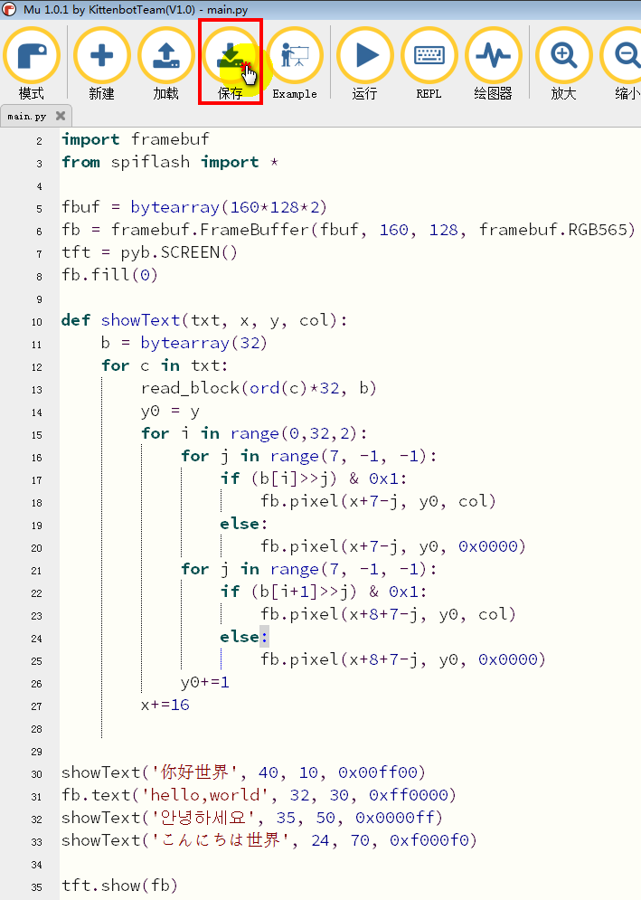
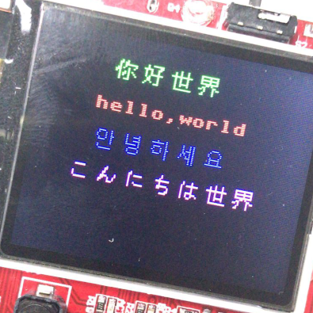

#液晶屏显示多国语言字符

前面一节我们学习了如何使用液晶屏和framebuf这个库，我们可以使用`fb.text`这个函数显示字符串。

但是这个字符串显示的功能相当局限，只能显示ascII字符（一般的英文字母数字还有常见的标点符号)

如果要显示中文或其他语言的字符就需要额外的字符编码表了。

所谓字符编码表就是保存了各种字符串和液晶屏需要显示点阵内容的映射，如果一个字符需要16x16个像素也就是32个字节，那么中国5000个汉字就需要160k的储存空间了（也就是喵bit的硬盘空间，注意和内存空间区分），何况还有其他各种语言的各种字符。很明显将这些字符串码表保存在代码中相当不现实，这时候我们就需要借助外部存储了。

在喵bit上有一颗2M的spi-flash，我们出厂烧录了12x12像素unicode码表，这里面基本涵盖了这个星球上所有的语言。这一节我们就需要教大家如何使用这个外部码表。(makecode下多语言显示也是使用同样的字库)

## spi-flash驱动库

正如之前说了我们使用的是外部的spi-flash，这就需要导入外部的驱动程序。

打开mu新建一个空文件，把以下的代码粘贴到其中，并保存到PYBFLASH这个U盘上，文件名称为spiflash.py

	# spiflash  SPI flash http://www.adafruit.com/product/1564 
	# SPI 1 42mhz max   SPI 2  21 mhz max
	# SPI1 X5-X8 CS CLK MISO MOSI   3.3v grnd
	import pyb
	from pyb import SPI
	import ubinascii
	import gc
	
	CMD_JEDEC_ID = 0x9F
	CMD_READ_STATUS = 0x05 # Read status register
	CMD_READ = 0x03 # Read @ low speed
	CMD_READ_HI_SPEED = 0x0B # Read @ high speed
	CMD_WRITE_ENABLE = 0x06 # Write enable
	CMD_PROGRAM_PAGE = 0x02 # Write page
	CMD_ERASE_4k = 0x20
	CMD_ERASE_32k = 0x52
	CMD_ERASE_64k = 0xD8
	CMD_ERASE_CHIP = 0xC7
	CMD_READ_UID = 0x4B
	PAGE_SIZE = 256
	
	cmds = {'4k':CMD_ERASE_4k, '32k':CMD_ERASE_32k, '64k':CMD_ERASE_64k}
	
	def read_block(addr,buff):
	    cs.low()
	    spi.send(CMD_READ)
	    spi.send(addr>>16)
	    spi.send(addr>>8)
	    spi.send(addr)
	    spi.recv(buff)
	    cs.high() 	 	
	
	def getid():
	    cs.low()
	    spi.send(CMD_JEDEC_ID)    # id
	    r = spi.recv(3)
	    cs.high()
	    print ("get id", ubinascii.hexlify(r))
	
	def wait():
	  while True:
	    cs.low()
	    spi.send(CMD_READ_STATUS)
	    r = spi.recv(1)[0]
	    cs.high()
	    if (r == 0) :
	        return
	
	def write_block(addr,buff):
	    # write in 256-byte chunks
	    # could check that doesn't go past end of flash ...
	    length = len(buff)
	    pos = 0
	    while (pos < length):
	        size = min(length-pos, PAGE_SIZE)
	        cs.low()
	        spi.send(CMD_WRITE_ENABLE)
	        cs.high()
	
	        cs.low()
	        spi.send(CMD_PROGRAM_PAGE)
	        spi.send(addr>>16)
	        spi.send(addr>>8)
	        spi.send(addr)
	        spi.send(buff[pos:pos+size])
	        cs.high()
	        wait()
	        addr += size
	        pos += size
	
	def erase(cmd,addr):
	    cs.low()
	    spi.send(CMD_WRITE_ENABLE)
	    cs.high()
	    cs.low()
	    spi.send(cmds[cmd])
	    spi.send(addr>>16)
	    spi.send(addr>>8)
	    spi.send(addr)
	    cs.high()
	    t = pyb.micros()
	    wait()
	    t = pyb.micros() - t
	    print ("erase",cmd,t,'us')
	
	def erase_chip():
	    cs.low()
	    spi.send(CMD_WRITE_ENABLE)
	    cs.high()
	    cs.low()
	    spi.send(CMD_ERASE_CHIP)
	    cs.high()
	    t = pyb.micros()
	    wait()
	    t = pyb.micros() - t
	    print ("erase chip",t)
	
	# print("SPI flash")
	cs = pyb.Pin('PB1')
	cs.init(pyb.Pin.OUT_PP)
	cs.high()
	v = bytearray(4)
	spi = SPI(2, SPI.MASTER, baudrate=42000000,polarity=0,phase=0)
	wait()
	getid()
	
很多同学可能会纳闷，python语言也可以写驱动程序？实际上喵bit的驱动程序大部分都使用c++编写并固化到了固件中，这样做的好处是c++的执行效率要比python脚本高很多，缺点就是占用着芯片内部的程序空间不管你用不用它。两种本质完成的任务是一样的，只是效率和资源上取舍。

## 编写字符串显示程序

之后回到我们的main.py文件，我们先初始化framebuffer，并且导入我们刚刚保存的spiflash库，注意import导入不需要文件后缀。

	import pyb
	import framebuf
	from spiflash import *
	
	fbuf = bytearray(160*128*2)
	fb = framebuf.FrameBuffer(fbuf, 160, 128, framebuf.RGB565)
	tft = pyb.SCREEN()
	fb.fill(0)

之后我们定义一个字符串显示的函数，它的任务就是在flash中找到对应字符的点阵数据并渲染到framebuffer上的指定像素位置。

	def showText(txt, x, y, col):
	    b = bytearray(32)
	    for c in txt:
	        read_block(ord(c)*24, b)
	        y0 = y
	        for i in range(0,24,2):
	            for j in range(7, -1, -1):
	                if (b[i]>>j) & 0x1:
	                    fb.pixel(x+7-j, y0, col)
	                else:
	                    fb.pixel(x+7-j, y0, 0x0000)
	            for j in range(7, -1, -1):
	                if (b[i+1]>>j) & 0x1:
	                    fb.pixel(x+8+7-j, y0, col)
	                else:
	                    fb.pixel(x+8+7-j, y0, 0x0000)
	            y0+=1
	        x+=16

最后激动人心的时刻到了，我们来显示多国语言的helloworld~

    showText('你好世界', 40, 10, 0x00ff00)
    fb.text('hello,world', 32, 35, 0xff0000)
    showText('안녕하세요', 35, 50, 0x0000ff)
    showText('こんにちは世界', 24, 70, 0xf000f0)
	
	tft.show(fb)

最后保存main.py文件并复位喵bit。

PS1：当然也可以直接使用`showText('Hello world', 32, 30, 0xff0000)`直接显示英文

PS2：有能力的同学也可以diy自己的字符库甚至图片并保存到spi-flash中，我们的spiflash驱动程序已经包括了写入flash的函数接口。当然也需要修改对应的show方法。

## 注意事项

当在喵bit的u盘下建立新的文件后，必须要重启喵bit，当前的运行环境是不知道有新的库文件进来的。

如果您发现代码保存并复位喵bit没效果，可能是代码中有错误。这时候可用使用mu的代码检查功能，或者打开mu的终端工具，如果代码有异常启动后会将错误反馈到终端上。

