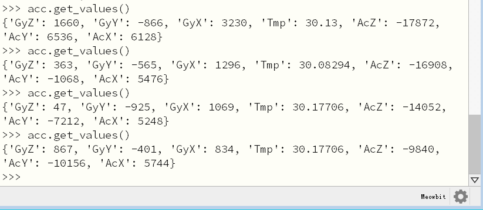

# 读取陀螺仪数据

喵bit上还板载了在创客项目中非常常见的6轴陀螺仪和加速度计mpu6050，理论上我们甚至可以diy一个平衡小车或无人机。

## 导入陀螺仪6050库

跟使用spi-flash一样，mpu6050库并没有放在固件中(内存宝贵)，我们需要外部导入。在喵bit的u盘根目录下建立mpu6050.py文件并复制下面的驱动代码到里面。

```python
	class accel():
	    def __init__(self, i2c, addr=0x68):
	        self.iic = i2c
	        self.addr = addr
	        self.iic.init()
	        self.iic.send(bytearray([107, 0]), self.addr)
	
	    def get_raw_values(self):
	        a = self.iic.mem_read(14, self.addr, 0x3B)
	        return a
	
	    def get_ints(self):
	        b = self.get_raw_values()
	        c = []
	        for i in b:
	            c.append(i)
	        return c
	
	    def bytes_toint(self, firstbyte, secondbyte):
	        if not firstbyte & 0x80:
	            return firstbyte << 8 | secondbyte
	        return - (((firstbyte ^ 255) << 8) | (secondbyte ^ 255) + 1)
	    
		def get_ac_x(self):                  # 单独读取x轴加速度值
			raw_ints = self.get_raw_values() 
			ac_x = 0
			ac_x = self.bytes_toint(raw_ints[0], raw_ints[1])
			return ac_x
    
		def get_ac_y(self):
			raw_ints = self.get_raw_values() 
			ac_y = 0
			ac_y = self.bytes_toint(raw_ints[2], raw_ints[3])
			return ac_y
			
		def get_ac_z(self):
			raw_ints = self.get_raw_values() 
			ac_z = 0
			ac_z = self.bytes_toint(raw_ints[4], raw_ints[5])
			return ac_z
		
		def get_g_x(self):						# 单独读取重力加速度值
			raw_ints = self.get_raw_values() 
			g_x = 0
			g_x = self.bytes_toint(raw_ints[8], raw_ints[9])
			return g_x
			
		def get_g_y(self):
			raw_ints = self.get_raw_values() 
			g_y = 0
			g_y = self.bytes_toint(raw_ints[10], raw_ints[11])
			return g_y
			
		def get_g_z(self):
			raw_ints = self.get_raw_values() 
			g_z = 0
			g_z = self.bytes_toint(raw_ints[12], raw_ints[13])
			return g_z

	    def get_values(self):					# 同时读取
	        raw_ints = self.get_raw_values()
	        vals = {}
	        vals["AcX"] = self.bytes_toint(raw_ints[0], raw_ints[1])
	        vals["AcY"] = self.bytes_toint(raw_ints[2], raw_ints[3])
	        vals["AcZ"] = self.bytes_toint(raw_ints[4], raw_ints[5])
	        vals["Tmp"] = self.bytes_toint(raw_ints[6], raw_ints[7]) / 340.00 + 36.53
	        vals["GyX"] = self.bytes_toint(raw_ints[8], raw_ints[9])
	        vals["GyY"] = self.bytes_toint(raw_ints[10], raw_ints[11])
	        vals["GyZ"] = self.bytes_toint(raw_ints[12], raw_ints[13])
	        return vals  # returned in range of Int16
	        # -32768 to 32767
	
		# 同时读取持续打印数据用于测试
	    def val_test(self):  # ONLY FOR TESTING! Also, fast reading sometimes crashes IIC
	        from time import sleep
	        while 1:
	            print(self.get_values())
	            sleep(0.2)
```

## 读取陀螺仪数据

回到mu的终端repl，我们首先要导入mpu6050的库。由于陀螺仪芯片是使用i2c接口和主芯片进行通信，我们还需导入i2c的对象。

```python
	import mpu6050
	from pyb import I2C, Pin
	
	i2c = I2C(1)
	acc = mpu6050.accel(i2c)
	acc.get_values()
```

最后一行就是读取陀螺仪的数据，大家可以在终端中多执行几次`acc.get_values()`这个命令。

MPU6050 测试 main.py

```python
    import mpu6050
    from pyb import I2C, Pin

    i2c = I2C(1)
    acc = mpu6050.accel(i2c)
    acc.val_test()
```


