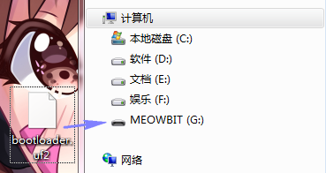
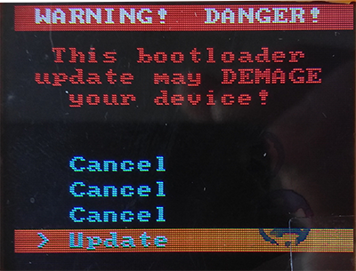
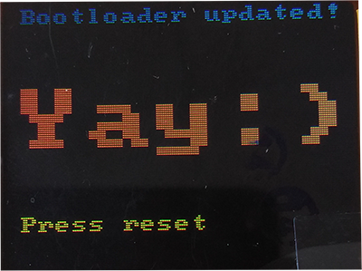
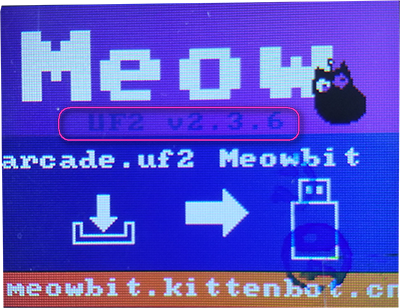

# 喵比特版本迭代

## bootloader迭代记录

下载地址：http://cdn.kittenbot.cn/meowbit/bootloader.uf2

2019.3.20 ：v2.36NEW 

## 喵比特的bootloader升级

每次增加新的功能，让喵比特支持更多东西以后，就需要对引导程序做一个升级新，而喵家程序猿已经将这个升级变得非常简单，没有多余的操作，你只需要在主界面下，将最新的bootloader.uf文件拖入MEOWBIT盘符下即可完成升级,未来每次更新我们都会通过迭代记录的方式告诉大家。

下面我们来详细介绍一下这简单的流程:

1. 下载新的bootloader.uf2(地址在上面，每次更新都使用同一个地址，请注意迭代记录)
 
2. 将bootloader.uf2拖入MEOWBIT盘符  

  

会出现如下界面，我们一定要选择最后一个Update并且按下按键A

  

之后会出现这个界面，提示需要按下reset按键，按下右侧上面的reset即可

   

成功后，就可以看到界面中间的版本号已经更新成最新的了

  

