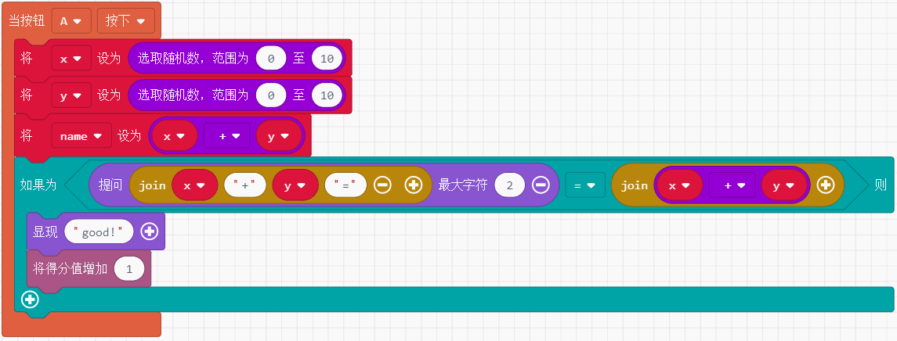
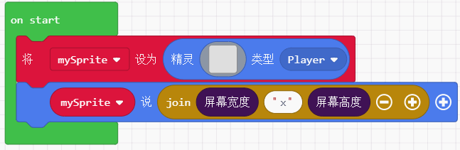
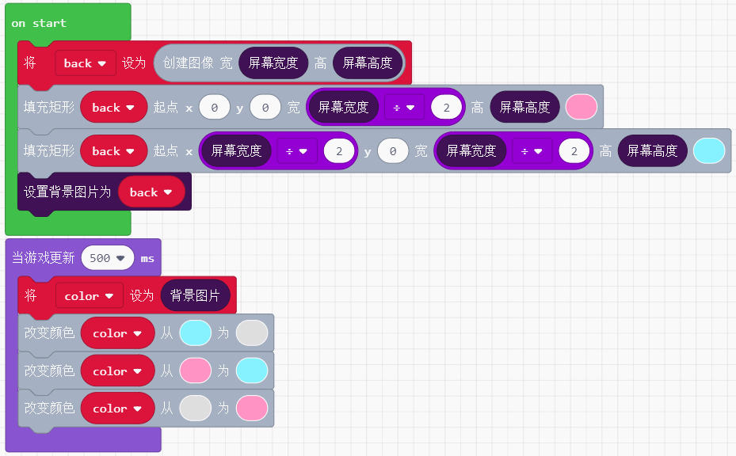
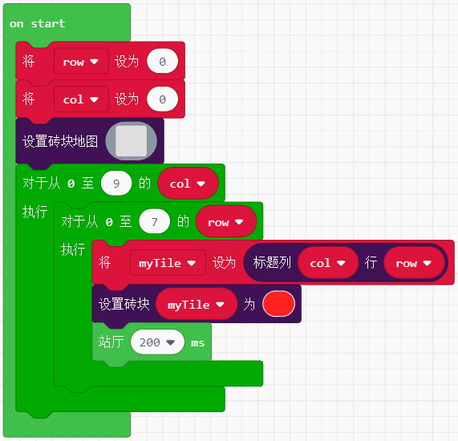
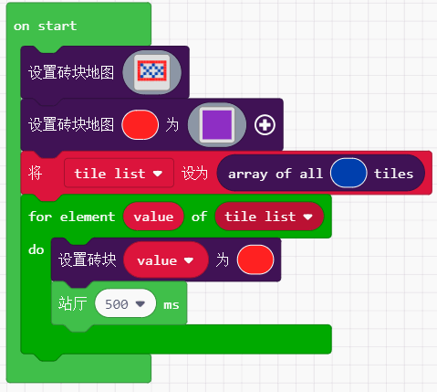
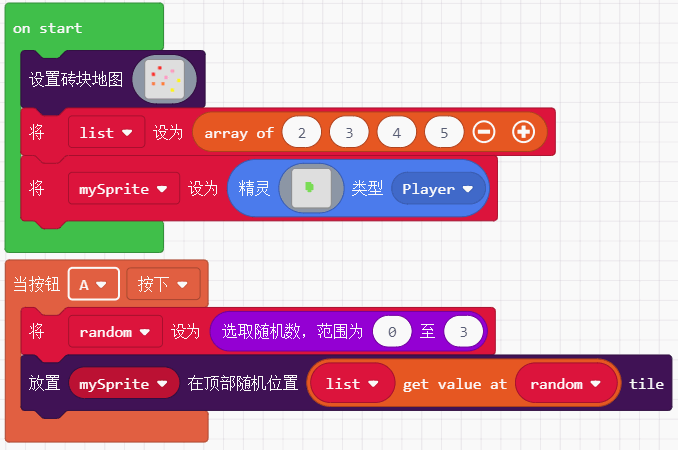
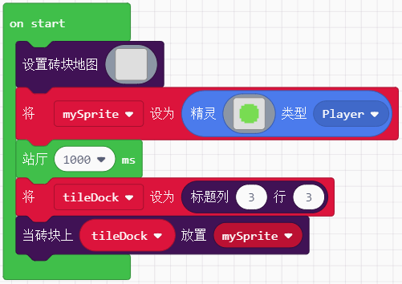

# makecode分栏积木块介绍  

## 音乐  

### 声音  

控制内置音乐的播放及停止

  

默认音量128（0~255）,可在on start下设置音量 
  
 

---  

### 音律  

**音调**  

可以选择给定钢琴调，也可自行拖拽Hz积木块

    

---  
**节拍**   

BPM是Beat Per Minute的简称，中文名为拍子数，释义为每分钟节拍数的单位  

   

---  

例子：按下B键播放一段惊心动魄的急促音效  

   

---
## 控制器  

一个积木块实现将精灵的移动联系到键盘的方向键。

 

```javascript
function moveSprite(sprite: Sprite, vx: number = 100, vy: number = 100);  
```   

例子： 

  

---
用于检测按键按下的两种方式  

 

```javascript
onEvent(event: ControllerButtonEvent, handler: () => void);  
isPressed(); //(返回:boolean)
```  

例子： 

 

---  
用于单独控制精灵x和y轴的移动
   

```javascript  
function dx(step: number = 100);    
function dy(step: number = 100);  
```  

例子： 

   

---  

## Game  

### Gameplay  

**游戏中地位相当于main函数**  

游戏中当精灵创建，销毁，重叠或碰撞时有可用于运行代码的事件。而当你希望定期来控制游戏中的某些事情时，你需要用到下面两个积木块。这两个积木块的区别是前者(更新频率由游戏引擎决定)几乎是无时无刻在执行，而后者则相当于定时器，每隔一定时间就执行一次。

  

```javascript  
//a：需要运行的代码，period:希望间隔运行代码的时间(毫秒)
function onUpdate(a: () => void): void; 
function onUpdateInterval(period: number, a: () => void): void;

//游戏循环的一个大致代码描述 
while (!gameOver) {
    checkInputs()
    gameUpdate()
    showGameUpdates()
}
```

例子： 

  

---  
游戏结束积木块，它的作用是用于结束整个游戏循环

  

```javascript  
//win：可选true或false用于显示到屏幕上玩家获胜与否，effect?:游戏结束时在背景显示内置特效
function over(win: boolean = false, effect?: effects.BackgroundEffect);
```  

例子：  

  
  
---      
得到一个自从游戏程序开始运行的时间(单位是ms)

  

```javascript
//number:记录从游戏开始以来的毫秒数  
function runtime(): number; 
```    

---   
重置游戏，恢复如初，从on start内容开始再执行
  
  

```javascript  
function reset();
```  

例子：  

 

---  

### 提示(询问)  

用于在屏幕中间显示标题和副标题

   

```javascript  
//subtitle显示在title下一行，且只能显示小于8px，故无法显示中文
function splash(title: string, subtitle?: string);
```  
!>此积木块可以显示中文，需要额外添加设置字体大小的积木块，并设置为12px。12px字体下，请误使用副标题

例子： 

   

---  

该积木块返回一个boolean，与逻辑判断积木块结合使用，当触发积木块后，玩家按A返回true，按B则为false。

  
  
```javascript  
function ask(title: string, subtitle?: string): boolean;  //如同显现积木块那样可以描述两行
// 返回一个boolean

```  
!>但此积木块不可显示中文。

例子：

    

---  
  
提问窗口，窗口下可输入字符进行回复，通过逻辑判断积木块来判断玩家输入的字符串是否为某个字符串进而执行特定程序。

  

```javascript   
function askForString(message: string, answerLength = 12);  
//message:提问的问题(字符串)， answerLength：可让玩家输入的字符个数(默认不选为12)
//返回值为玩家输入的字符串
```

!>但此积木块不可显示中文。

例子：0-10随机加法题

  

---  

### 对话框  

显示长文本功能作为对话框可能会频繁使用，对话框以后的积木块就不做详解，比较冷门。

 

```javascript
//str:你设计好的对话内容，layout：有left、right、top、bottom、center、full screen六种位置选择。  
function showLongText(str: string, layout: DialogLayout);
```  

---  

## 场景

### 屏幕  

得到并返回屏幕的像素宽和高 (喵比特是160x128)


```javascript
function screenWidth(): number;
```   

例子：  



---  

背景颜色的设置和获取  


```javascript
function setBackgroundColor(color: number); //设置背景颜色，颜色用0-15来表示
function backgroundColor() : number;  //获取颜色数值，未设置默认为0
```

例子：黑白背景切换实现闪屏  


--- 


  

```javascript
function setBackgroundImage(img: Image);  // img：作为设置背景的图片
function backgroundImage(): Image; //返回设置的背景图
```    

!>结合`图像`积木块，该分栏位于Advanced下。

例子：实现左右背景颜色每500ms交替  

   

---  

### 特效  
  
增加游戏体验，特效分别用于游戏中和游戏结束结果为win时  


    
  
例子：   
  
  

--- 

### 砖块  
  
游戏场景中包含砖块这个要素，它主要的功能在于奠定游戏的大场景，拥有物理特性。


 

```javascript  
function setTileMap(map: Image);  //map：通过颜色代号构建一个砖块场景，与屏幕中的像素比为1:16
function setTile(index: number, img: Image, wall?: boolean);  
//index:用于构建砖块的颜色代号，img：用于布置砖块的图案，collisions：(boolean)值为false时，精灵能够穿越砖块，为true时精灵将被砖块阻挡既生成物理碰撞
```   

例子：   

   

---  

下列两个积木块可结合使用，用于定位并替换砖块


   

```javascript  
//col、row:通过行和列来定位砖块  返回砖块在场景图中的位置，左上角为起始点0，0  
function getTile(col: number, row: number): tiles.Tile;  

//title:要替换的砖块对象， index：一个值用于替换之前的颜色代号
function setTileAt(tile: tiles.Tile, index: number);
```  

例子： 自上而下自左向右铺满红色砖块

   

---  

用于相同颜色索引的砖块批量替换

  

```javascript   
//index：一个颜色索引值  
//返回在砖块地图中具有相同颜色索引值的砖块数组  
function getTilesByType(index: number): tiles.Tile[];  
```  

例子：  

    

---  

可以将精灵准确的放置在砖块地图上的随机一个砖块位置上，通过颜色索引值去限制精灵所能匹配的砖块颜色类型  

   

```javascript  
//sprite：需要移动放置在砖块位置上的精灵， color：需要制定随机砖块的颜色索引
function placeOnRandomTile(sprite: Sprite, color: number): void;
```  

例子：设置一个有4中颜色索引的砖块地图，并且让绿色小精灵能够随机落在他们其中一个上    

    

---  

   

```javascript
//sprite：要移动到砖块上的精灵
place(mySprite: Sprite): void;
```
  
例子： 

  
