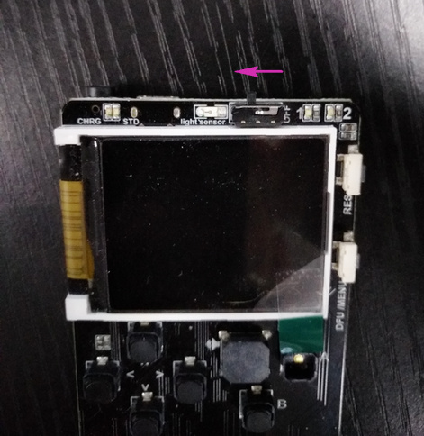

# 喵Bit 平台更新文档 2019年2月 {docsify-ignore-all}

**适用对象：天使用户和2019年2月前的用户**

非常感谢喵bit的天使用户和春节前后购买的用户对该产品的喜爱，我们收集了大量的反馈并对平台做出很多优化，并在2019元宵节迎来喵bit的第一次平台更新。跟着下面步骤完成您的喵比特更新。

## 进入dfu模式

!>在一切操作前我们必须要做的就是打开喵比特的电源开关(拨向左边)，但不要接电池(保持掉电状态) 

DFU在此可以理解为强制固件切换，要更换固件首先需要进到这个模式下。按住并保持喵比特侧方的DFU按键，紧接着插上usb数据线。

成功进入DFU模式后，在电脑设备管理器中会看到一个新的设备（这时候DFU按键就可以松开了），不同电脑显示名称有所区别，但是都会有STM32 xxxx的设备或者USB xxx设备，比如：

  

!>如果没有出现上述设备字样，请重新上述步骤。

如果windows尝试从网络自动安装驱动，可以不用理会并中断。

## 过滤驱动

?>1.下载带有新版BootLoader的dfutil：[http://cdn.kittenbot.cn/meowbit/dfutil.zip](http://cdn.kittenbot.cn/meowbit/dfutil.zip)

?>2.打开“zddig-2.4.exe” 如果你解压找不到这个，肯定是被360这个流氓软件杀了

?>3.打开后界面：

?>4.在options选择list all devices

?>5.之后在下拉框中找到STM32 BOOTLOADER，并选择Install Driver

?>6.然后耐心等待直到提示安装成功

!>板子在同一台电脑下使用仅仅只需要按照上述流程操作一次即可

## 更新BootLoader

?>1.打开上面下载的dfutil文件夹  

!>此前如果你没有按过复位按键或者断开电源，你任然在dfu模式下，可以直接进行下面的操作，否则将需要重新进入dfu模式  

?>2.点击`BootLoader.bat`脚本更新BootLoader。刷新完成后按reset会进入BootLoader更新提示框

?>3.使用下按键选择最后一项并按A按钮进行BootLoader刷新
  

?>4.完成后请再次复位,更新成功后会出现全新的BootLoader界面, 如下图

?>5.按住键盘方向键左按钮不松开，之后同时按一下侧边的reset按钮并松开，喵bit会进入spi-fs模式。

?>6.第一次进入该模式window可能会提示需要格式化，请注意将其格式化为fat格式(一般默认)。弹出框中选确定既可。

  

  

!>格式化成功后出现这样一个盘符  
  

?>7.下载新的Unicode字库文件(此字库makecode和micropython通用)，并将它拖入这个盘符下
[http://cdn.kittenbot.cn/meowbit/unicode12.bin](http://cdn.kittenbot.cn/meowbit/unicode12.bin)  

  

?>8.最后按下复位按键便完成了，可以开始你的编程之旅了~  

